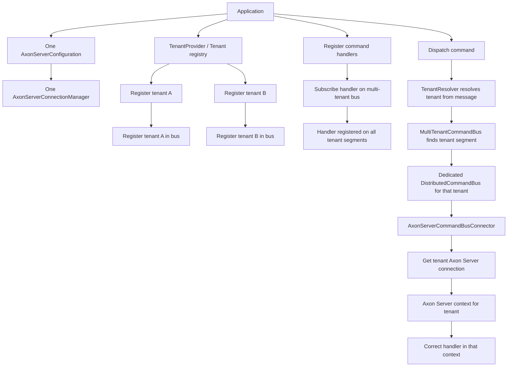
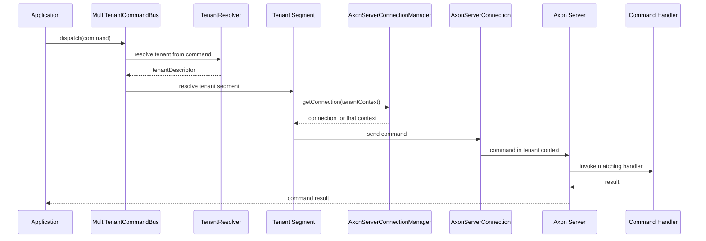
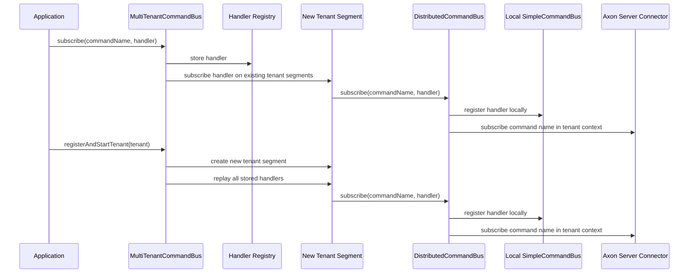

# Axoniq Multi Tenancy

* [Issue-4324](https://github.com/AxonIQ/AxonFramework/issues/4324)

## Purpose

Brings multi-tenancy-support to Axoniq Framework. AF4 supported this via the extensions-multitenancy module.

Multi-Tenancy aims for strict data isolation between tenants. 

## Scope

* Multi-Tenancy is only supported for Axon Server use cases. Each tenant must be configured in its own axon-server context.
  * Note: This mixes the terms "Bounded Context" and "Tenant". If you design a DDD system with multiple bounded contexts (Customer Management, Billing, Warehouse) and use multiple tenants, this would mean that your contexts are "billing-customerA", "billing-customerB".
* The framework keeps one shared Axon Server configuration and one shared multi-tenancy infrastructure setup.
* Tenants differ by connection target only: each tenant gets a dedicated Axon Server connection for its context, but not a separate Axon Server configuration object or copied infrastructure graph.
* To avoid multiple datasource connections for token storage, we will focus on the new persistent stream feature only for the first PoC.

## Assumption

* We are working with one cluster of axon servers, and each tenant has its own axon server context following the naming conventions stated above.
* Tenant ID is the default context name unless a dedicated mapping is introduced later.
* A feature/use case implemented for multiple tenants will structurally be a singleton use case, so routing and storage must be tenant-specific, business logic must be tenant agnostic.

## Considerations

* The AF4 extension basically copied all infrastructure components for each tenant, giving you n+1 (n=tenants, 1= localSegment) instances for each module. This should be avoided.
* For the Axon Server path, the intended model is n connections for n tenant contexts, not n copies of the full infrastructure stack.
* The connector is single-context per instance, so tenant-specific Axon Server wiring should be implemented as one connector/command bus segment per tenant context, not as a context-switching shared connector.

## Questions

* How are tenants (aka server contexts with special naming convention) are configured? 

## Setup Flow

The intended Axon Server multitenancy setup is:

* one shared `AxonServerConfiguration`
* one shared `AxonServerConnectionManager`
* one tenant registry/provider that knows which tenants exist
* one `MultiTenantCommandBus` at the application level
* one dedicated command-bus segment per tenant context

The tenant-specific segment is not a copied application stack. It is only:

* one `AxonServerConnection` for the tenant context
* one `AxonServerCommandBusConnector`
* one local `SimpleCommandBus`
* one `DistributedCommandBus`

### How Tenants Become Known

Tenants are made known to the system by a tenant provider or registry. Typical sources are:

* a static list from configuration
* contexts discovered from Axon Server
* an external source of truth such as a database or configuration service

Once a tenant is known, it is registered with the multi-tenant command bus:

```java
multiTenantCommandBus.registerAndStartTenant(TenantDescriptor.tenantWithId("tenant-a"));
```

### Command Dispatch Flow

1. Application code dispatches a command to `MultiTenantCommandBus`.
2. `TenantResolver` resolves the tenant for the command.
3. `MultiTenantCommandBus` looks up the tenant segment.
4. The tenant segment is a `DistributedCommandBus`.
5. The distributed bus uses its connector.
6. The connector uses the tenant-specific Axon Server connection.
7. Axon Server receives the command in the tenant context.
8. Axon Server routes the command to the matching handler in that context.

### Mermaid Overview





### Practical Summary

* Tenants are registered through a provider/registry.
* Handlers are registered once on `MultiTenantCommandBus`.
* `TenantResolver` selects the tenant per command.
* The tenant segment uses the tenant context connection.
* The system keeps one shared Axon Server configuration and one shared infrastructure setup.
* The only tenant-specific variation is the connection target, not a copied configuration graph.

### Why Handlers Still Work With New Tenant Segments

This is the key detail in the current design:

* command handlers are not registered on one global shared `SimpleCommandBus`
* instead, every tenant gets its own local `SimpleCommandBus`
* the multi-tenant bus keeps the handler definitions centrally
* when a new tenant segment is created, the existing handlers are replayed onto that new segment

So the factory can create a brand new tenant segment at tenant registration time without losing handler registrations.
The new segment starts empty, and `MultiTenantCommandBus` repopulates it from its own handler registry.

That means the registration path is:

1. A handler is registered once on `MultiTenantCommandBus`.
2. `MultiTenantCommandBus` stores the handler in its internal handler map.
3. The handler is propagated to all already existing tenant segments.
4. Each tenant segment registers the handler on its own local `SimpleCommandBus`.
5. The `DistributedCommandBus` then subscribes the command name on the tenant-specific Axon Server connector.

And the tenant startup path is:

1. A tenant is discovered or registered.
2. `MultiTenantCommandBus` asks the tenant segment factory for a bus for that tenant.
3. The factory creates a fresh tenant-local command bus stack.
4. `MultiTenantCommandBus` replays all already known handlers onto that new tenant segment.
5. The tenant segment becomes ready to receive commands for that tenant context.

### Handler Replay Diagram



### What This Means Operationally

If you have tenants `tenant-a` and `tenant-b`:

* `tenant-a` gets its own local `SimpleCommandBus`
* `tenant-b` gets its own local `SimpleCommandBus`
* both tenant segments receive the same handler registrations
* the handler instance is reused
* the bus segment state is not reused
* each tenant segment points at its own Axon Server context connection

This is why a new tenant segment is not a problem:

* the tenant segment is the runtime container for that tenant
* the `MultiTenantCommandBus` is the source of truth for registered command handlers
* tenant segments can be created later and still receive the full handler set

### Short Recap

* handler registration is central
* handler execution is tenant-specific
* tenant segments are created on demand
* new tenant segments are rehydrated with the existing handler set
* the Axon Server connection differs per tenant context
* the configuration remains shared

### Query Bus Parity

The query side follows the same multi-tenant shape as the command side:

* one shared Axon Server configuration
* one shared connection manager
* one tenant-specific connection per Axon Server context
* one tenant-local `SimpleQueryBus`
* one tenant-local `DistributedQueryBus`
* one `MultiTenantQueryBus` that resolves the tenant and delegates to the matching tenant segment

The only meaningful difference is the tenant lookup source for update-style operations:

* `query(...)`, `subscriptionQuery(...)`, and `subscribeToUpdates(...)` resolve the tenant directly from the `QueryMessage`
* `emitUpdate(...)`, `completeSubscriptions(...)`, and `completeSubscriptionsExceptionally(...)` resolve the tenant from the current `ProcessingContext`
* the `ProcessingContext` carries the current `Message` via `Message.fromContext(processingContext)`

That preserves the README rule set:

* no N+1 infrastructure graph
* one shared framework setup
* only tenant-specific connections and segments
