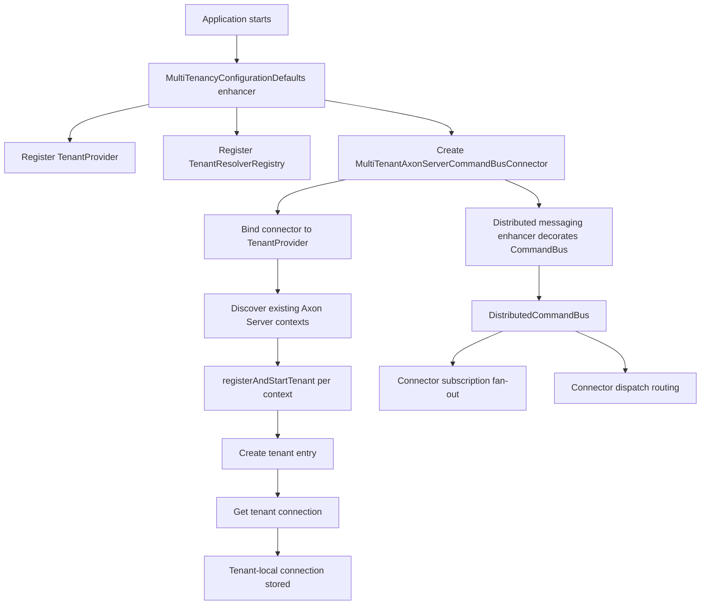
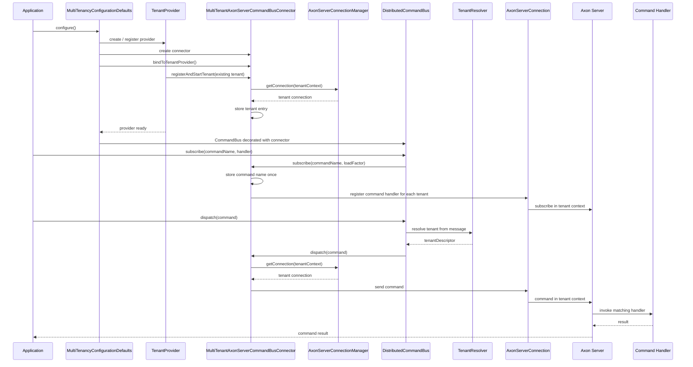

# Axoniq Multi Tenancy

* [Issue-4324](https://github.com/AxonIQ/AxonFramework/issues/4324)

## Purpose

Brings multi-tenancy-support to Axoniq Framework. AF4 supported this via the extensions-multitenancy module.

Multi-Tenancy aims for strict data isolation between tenants. 

## Scope

* Multi-Tenancy is only supported for Axon Server use cases. Each tenant must be configured in its own axon-server context.
  * Note: This mixes the terms "Bounded Context" and "Tenant". If you design a DDD system with multiple bounded contexts (Customer Management, Billing, Warehouse) and use multiple tenants, this would mean that your contexts are "billing-customerA", "billing-customerB".
* The framework keeps one shared Axon Server configuration and one shared multi-tenancy infrastructure setup.
* Tenants differ by connection target only: each tenant gets a dedicated Axon Server connection for its context, but not a separate Axon Server configuration object or copied infrastructure graph.
* To avoid multiple datasource connections for token storage, we will focus on the new persistent stream feature only for the first PoC.

## Assumption

* We are working with one cluster of axon servers, and each tenant has its own axon server context following the naming conventions stated above.
* Tenant ID is the default context name unless a dedicated mapping is introduced later.
* A feature/use case implemented for multiple tenants will structurally be a singleton use case, so routing and storage must be tenant-specific, business logic must be tenant agnostic.

## Considerations

* The AF4 extension basically copied all infrastructure components for each tenant, giving you n+1 (n=tenants, 1= localSegment) instances for each module. This should be avoided.
* For the Axon Server path, the intended model is n connections for n tenant contexts, not n copies of the full infrastructure stack.
* The connector is single-context per instance, so tenant-specific Axon Server wiring should be implemented as one connector/command bus segment per tenant context, not as a context-switching shared connector.

## Questions

* How are tenants (aka server contexts with special naming convention) are configured? 

## Setup Flow

The current Axon Server multitenancy setup is:

* one shared `AxonServerConfiguration`
* one shared `AxonServerConnectionManager`
* one shared `TenantProvider`
* one shared `TenantResolverRegistry`
* one `CommandBusConnector` that is actually a `MultiTenantAxonServerCommandBusConnector`
* one `DistributedCommandBus` decorated in by the normal distributed messaging enhancer

The tenant-specific runtime is not a copied application stack. It is only:

* one `AxonServerConnection` per tenant context
* one tenant-local command subscription registry
* one tenant-local in-flight command map

### What Happens At Startup

1. The application configurer runs the multi-tenancy enhancer.
2. The enhancer registers `TenantConnectPredicate`, `TenantProvider`, and `TenantResolverRegistry`.
3. The enhancer creates `MultiTenantAxonServerCommandBusConnector`.
4. The enhancer binds the connector to the `TenantProvider`.
5. The `TenantProvider` discovers the existing Axon Server contexts.
6. For every matching context, the provider calls `registerAndStartTenant(...)` on the connector.
7. The connector creates a tenant entry and asks `AxonServerConnectionManager` for the connection for that tenant context.
8. The connector stores that connection and waits for command subscriptions.
9. Later, the distributed messaging enhancer sees the registered `CommandBusConnector` and decorates the application `CommandBus` into a `DistributedCommandBus`.

### What Happens When A Tenant Is Registered

When the provider adds a tenant, the connector:

* creates the tenant entry if it does not exist yet
* stores the tenant-specific `AxonServerConnection`
* replays every command name that has already been subscribed
* makes that tenant immediately ready for command dispatch and handler subscriptions

This means a tenant can appear after the application already started and it still receives the full command handler set.

### Command Handler Subscription Flow

1. Application code subscribes a command handler on the `CommandBus`.
2. The `DistributedCommandBus` forwards that subscription to the `CommandBusConnector`.
3. `MultiTenantAxonServerCommandBusConnector` stores the command name and load factor once.
4. The connector loops over all known tenants.
5. For each tenant it registers the handler on that tenant’s Axon Server command channel.
6. Axon Server now knows that this handler exists in every tenant context.

### Command Dispatch Flow

1. Application code dispatches a command on the shared `CommandBus`.
2. `TenantResolver` resolves the tenant from the command message.
3. `DistributedCommandBus` delegates the dispatch to the connector.
4. `MultiTenantAxonServerCommandBusConnector` resolves the tenant again and selects the matching tenant entry.
5. The connector uses that tenant’s `AxonServerConnection`.
6. Axon Server receives the command in that tenant context.
7. Axon Server routes the command to the matching handler in that context.

### Mermaid Overview

### Practical Summary

* Tenants are discovered by the provider.
* The enhancer binds the connector to the provider after creation.
* Existing tenants are registered immediately.
* Handler subscriptions are fanned out to every tenant.
* Dispatch uses the tenant resolved from the command message.
* The only tenant-specific variation is the connection target, not a copied configuration graph.

### Short Recap

* handler registration is central
* handler execution is tenant-specific
* tenant segments are created on demand
* new tenant segments are rehydrated with the existing handler set
* the Axon Server connection differs per tenant context
* the configuration remains shared

### Query Bus Parity

The Axon Server-backed query side follows the same multi-tenant shape as the command side:

* one shared Axon Server configuration
* one shared connection manager
* one tenant-specific connection per Axon Server context
* one `MultiTenantAxonServerQueryBusConnector` that resolves the tenant and talks to the matching connection

The only meaningful difference is the tenant lookup source for update-style operations:

* `query(...)` and `subscriptionQuery(...)` resolve the tenant directly from the `QueryMessage`
* `emitUpdate(...)`, `completeSubscriptions(...)`, and `completeSubscriptionsExceptionally(...)` resolve the tenant from the current `ProcessingContext`
* the `ProcessingContext` carries the current `Message` via `Message.fromContext(processingContext)`

That preserves the README rule set:

* no N+1 infrastructure graph
* one shared framework setup
* only tenant-specific connections and segments

## Current state - 17.06.2026

The module is now in a working AF5 multi-tenancy shape, with the following pieces in place:

* `MultiTenancyConfigurationDefaults` is the main wiring entry point.
* `TenantResolverRegistry` is present and the example configuration uses the default metadata-based resolver.
* `TenantConnectPredicate` is used to decide which Axon Server contexts should be treated as tenants.
* `MultiTenantAxonServerCommandBusConnector` and `MultiTenantAxonServerQueryBusConnector` both keep tenant-local connector state and replay subscriptions when new tenants appear.
* `TenantRoutingEventStore` routes event-store work to tenant-specific event-store segments.
* `TenantPersistentStreamMessageSourceFactory` now exists as the seam for building tenant-specific persistent stream message sources.
* `MultiTenantPersistentStreamMessageSource` fans out one consumer to per-tenant persistent stream sources and names the tenant streams by tenant id.

What the current implementation already proves:

* tenant discovery and registration work with the shared `TenantProvider`
* command, query, event-store, and persistent-stream routing are covered by unit tests
* the non-Spring example under `examples/multi-tenancy-java` exercises the module against Axon Server with two tenants (`foo-a` and `foo-b`)
* tenant metadata is propagated through the example via the default `tenantId` metadata key

What is still explicitly unfinished or intentionally left open:

* `MultiTenancyConfigurationDefaults` still contains `FIXME` placeholders for embedded-mode defaults, snapshot-store support, and tenant component parameter resolvers
* the `TenantPersistentStreamMessageSourceFactory` is wired, but the module still depends on the surrounding Axon Server multi-tenant setup to provide the right tenant contexts

In short: the module is beyond the proof-of-concept stage for Axon Server command/query/event-store routing and persistent streams, but the generalized multi-tenancy API surface still has clear follow-up work marked in code.
