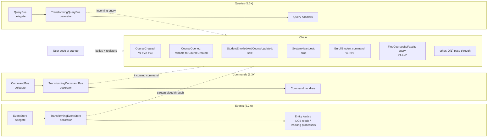

# Event Transformation -- Design Meeting Cheat Sheet

Full design: [spec.md](../spec.md), [plan.md](../plan.md), [contracts/](contracts/).

---

## 1. The pitch

AF5 successor to AF4 **upcasters**. Same job -- rewrite an old event into the shape today's handlers expect at read time -- but with a simpler design:

- **No `IntermediateEventRepresentation`.** Transformations operate on typed `MessageStream<EventMessage>` directly.
- **One generic SPI over `Message`.** Events ship in 5.2.0; commands + queries slot in for 5.3+ with no SPI break.
- **One chain object per app.** Built once at startup, locked, immutable.
- **Decorator on `EventStore`** (the public interface), NOT on the `@Internal` `EventStorageEngine` -- so it works for every future `EventStore` family, not just storage-engine-backed ones.

---

## 2. Architecture at a glance

One `MessageTransformerChain` instance, registered once at startup, wired into three ingress points:



Key invariants:

- **Read / receive side only.** Stored events, dispatched commands, and dispatched queries are never mutated -- transformation runs at read (events) or on the incoming handler side (commands/queries).
- **Decorators target the bus / store, NOT the connectors.** Transformation works without any distributed-messaging dependency, and tests don't need to go over the wire. Each registered handler is wrapped at `subscribe(...)` time so local + remote both fire the chain.
- **Non-matching messages** (most of them) flow through in `O(1)` with **no payload conversion** -- protects replay throughput (FR-011).
- **Output re-enters routing** by its new `QualifiedName` -- this is how `CourseCreated v1 -> v2 -> v3` chains compose.
- **Per-transformer hooks**, not chain-wide: each transformer optionally carries its own `.when(...)` predicate + `.onApplied(...)` observer. Default methods on the base `MessageTransformer<M>` -- events, commands, and queries all inherit them. Matches AF4 `SingleEntryUpcaster.canUpcast` / `doUpcast`. Default: always / no-op, zero per-event allocation.
- Decorator order is `Integer.MIN_VALUE + 1000`, outer than `InterceptingEventStore` (`+50`) / `InterceptingCommandBus` (`+100`) / `InterceptingQueryBus` (`+100`) -- so any handler-side data-protection interceptor sees the transformed shape.

---

## 3. The user API

One chain. One builder. Three factories -- `EventTransformation` (5.2.0), `CommandTransformation` + `QueryTransformation` (5.3+). Events get four patterns; commands and queries get 1:1 + rename only (single-intent -- no split / drop). Every transformer can optionally carry per-transformer hooks: `.when(Predicate)` (skip if `false`) and `.onApplied(BiConsumer)` (post-apply observer for logging / metrics) -- both default to "always" / no-op with zero per-event allocation. Matches the AF4 `SingleEntryUpcaster.canUpcast` / `doUpcast` precedent.

```java
MessageTransformerChain chain = MessageTransformerChain.builder()
    .versionOrder(SemverComparator.instance())   // optional

    // ---------- Events (5.2.0) ----------

    // (A) 1:1 structural transform -- v1's "capacity" splits into min/max
    //     Optional per-transformer hooks (.when / .onApplied) shown here.
    .register(EventTransformation
            // from should be overloaded and predicate allowed (only support exception when semver comparator otherwise user responsibility)
        .from(new MessageType("com.example.CourseCreated", "1.0.0"))
        .to  (new MessageType("com.example.CourseCreated", "2.0.0"))
        .transform(JsonNode.class, v1 -> {
            int cap = v1.get("capacity").asInt();
            ObjectNode v2 = JsonNodeFactory.instance.objectNode();
            v2.put("minCapacity", cap);
            v2.put("maxCapacity", cap);
            v2.put("name", v1.get("name").asText());
            return v2;
        })
            // not in first version
        .when     (in       -> !featureFlags.isDisabled("course-created-upcast"))
        .onApplied((in, out) -> log.trace("CourseCreated v1 -> v2 applied to {}", in.identifier())))

    // (B) Pure rename -- payload unchanged, identity rewritten
    .register(EventTransformation.rename(
        new MessageType("com.example.CourseOpened",  "1.0.0"),
        new MessageType("com.example.CourseCreated", "1.0.0")))

    // (C) 1:N split -- one event becomes several
    .register(EventTransformation
        .split(new MessageType("com.example.StudentEnrolledAndCourseUpdated", "1.0.0"))
        .transform(JsonNode.class, v1 -> List.of(
            TransformedEvent.of(new MessageType("com.example.StudentEnrolled",       "1.0.0"), v1.get("studentEnrollment")),
            TransformedEvent.of(new MessageType("com.example.CourseCapacityUpdated", "1.0.0"), v1.get("courseUpdate")))))

    // (D) 1:0 drop -- suppress junk events; tracking token still advances
    .register(EventTransformation.drop(
        new MessageType("com.example.SystemHeartbeat", "1.0.0")))

    // ---------- Commands (5.3+) ----------

    // (E) 1:1 command transform -- fill a default `enrollmentReason` for older callers
    .register(CommandTransformation
        .from(new MessageType("com.example.EnrollStudent", "1.0.0"))
        .to  (new MessageType("com.example.EnrollStudent", "2.0.0"))
        .transform(JsonNode.class, v1 -> {
            ObjectNode v2 = v1.deepCopy();
            v2.put("enrollmentReason", "UNKNOWN");
            return v2;
        }))

    // CommandTransformation does NOT expose split(...) / drop(...) -- compile-time forbidden.

    // ---------- Queries (5.3+) ----------

    // (F) 1:1 query transform -- fill a default `includeArchived` filter for older callers
    .register(QueryTransformation
        .from(new MessageType("com.example.FindCoursesByFaculty", "1.0.0"))
        .to  (new MessageType("com.example.FindCoursesByFaculty", "2.0.0"))
        .transform(JsonNode.class, v1 -> {
            ObjectNode v2 = v1.deepCopy();
            v2.put("includeArchived", false);
            return v2;
        }))

    .build();

EventSourcingConfigurer.create()
    .componentRegistry(cr -> cr.registerComponent(MessageTransformerChain.class, c -> chain))
    .start();
```

**That's it.** Three ServiceLoader-discovered enhancers pick up the same chain and install their respective decorators automatically: `EventTransformationConfigurationEnhancer` -> `TransformingEventStore` (5.2.0); `CommandTransformationConfigurationEnhancer` -> `TransformingCommandBus` (5.3+); `QueryTransformationConfigurationEnhancer` -> `TransformingQueryBus` (5.3+).

**Error handling** -- all caught at startup, before any event is processed:

| Mistake | Surfaced at |
|---|---|
| duplicate `from` | `register(...)` |
| self-loop (`from == to`) | `register(...)` |
| multi-step cycle | `.build()` (with full edge list) |
| version-order violation | `.build()` (only with a `VersionComparator`) |
| runtime exception in mapper | propagated with transformation + event + stream position |

---

## 4. Scope -- what ships in 5.2.0 vs. later

Issue [AxonIQ/axoniq-framework#137](https://github.com/AxonIQ/axoniq-framework/issues/137).

| Tier | User stories | What it gives |
|---|---|---|
| **5.2.0 MUST** | US1 -- 1:1 structural transform | enough to close the issue (pattern A above) |
| **5.2.0 SHOULD** | US2 -- rename; US7 -- per-transformer hooks | small additive surface (pattern B; `.when(...)` + `.onApplied(...)` on each `EventTransformer`) |
| **5.2.0 MAY** | US3 -- split, US4 -- drop, US5 -- chaining, US6 -- conflict detection | the rest (patterns C, D; conflict checks) |
| **5.3+** | US8 commands, US9 queries, snapshot transform | architecturally already supported; sub-packages reserved |

The **architecture commits** to the full design from day one (see plan.md "Forward-compatibility invariants") -- everything held back lands as pure additive changes, no SPI break. Specifically:

1. Generic SPI over `Message` (not event-specific) -- so commands/queries plug in cleanly.
2. Chain models 0..N outputs from day one -- so split/drop don't need a rewrite.
3. `from(...)`, `rename(...)`, `split(...)`, `drop(...)` method names reserved on the factory.
4. Single chain object holds everything -- events now, commands/queries later.

---

## 5. Verification -- design decisions to confirm

1. **Decoration target -- `EventStore` over `EventStorageEngine`.** Storage engine is `@Internal`; decorating the public `EventStore` keeps transformation available to any future `EventStore` implementation (not just storage-engine-backed ones). Same logic for 5.3+: decorate `CommandBus` / `QueryBus`, NOT the connectors.
2. **`MessageStream.flatMap` upstream addition.** Needed only if 1:N split (US3) lands in 5.2.0. In-module fallback documented; final decision made at the moment US3 is picked up.
3. **Version ordering default.** Registration order = apply order (matches AF4). `VersionComparator` opt-in via `Builder.versionOrder(...)`; `SemverComparator` ships as a built-in.
4. **Observability surface.** Per-transformer hooks on the base `MessageTransformer<M>` SPI -- events, commands, queries all inherit `.when(Predicate<M>)` + `.onApplied(BiConsumer<M, MessageStream<? extends M>>)`. Matches AF4 `SingleEntryUpcaster.canUpcast` / `doUpcast`. Framework does NOT install a default logging implementation -- users wire SLF4J / Micrometer through the hooks. No chain-wide hooks on the Builder; no generic namespaces (`Observability`, `Logger`).
5. **Generic SPI over `Message` from day one.** `MessageTransformer<M extends Message>` is the root; `EventTransformer` is the only 5.2.0 specialization. `CommandTransformer` / `QueryTransformer` slot in for 5.3+ with zero SPI break.

---

## References

- [spec.md](../spec.md) -- full functional spec, US1-US9, FR-001 to FR-021
- [plan.md](../plan.md) -- delivery scope, module layout, forward-compat invariants
- [contracts/public-api.md](../contracts/public-api.md) -- full user-facing API + end-to-end example incl. 5.3+ commands/queries
- [contracts/spi-base.md](../contracts/spi-base.md) -- `MessageTransformer`, `MessageTransformerChain`, `VersionComparator`
- [contracts/spi-events.md](../contracts/spi-events.md) -- `EventTransformer`, `TransformingEventStore`, configuration enhancer
- [contracts/spi-commands-queries.md](../contracts/spi-commands-queries.md) -- 5.3+ deferred shapes
