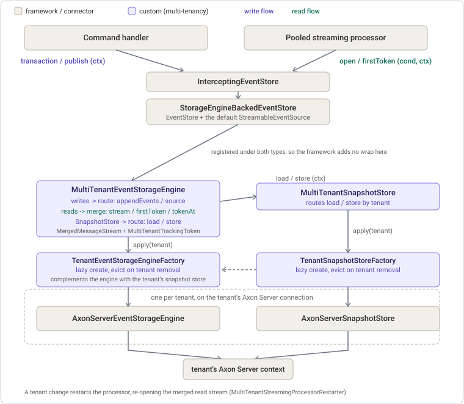

# ADR 001: Per-tenant event storage routing (issue [#209](https://github.com/AxonIQ/axoniq-framework/issues/209))

Date: 2026-07-23
Status: accepted
Related: [ADR 002, multi-tenant pooled streaming](adr-002-pooled-streaming.md) ([#210](https://github.com/AxonIQ/axoniq-framework/issues/210)), [#213](https://github.com/AxonIQ/axoniq-framework/issues/213) (per-tenant JPA storage), [#205](https://github.com/AxonIQ/axoniq-framework/issues/205) (no tenant data in stored events), [#206](https://github.com/AxonIQ/axoniq-framework/issues/206) (tenant-scoped components)

## Context

Every tenant gets its own event store in its own Axon Server context. Writing, sourcing, snapshotting, and the read stream that feeds projections must all reach the right tenant's store. The tenant is already known during handling. The `RegisterTenantDescriptorHandlerInterceptor` from [#206](https://github.com/AxonIQ/axoniq-framework/issues/206) puts it on the `ProcessingContext` (under `TenantDescriptor.RESOURCE_KEY`).

The design question is at which layer to route. The `EventStore` is the facade a command handler talks to. The `EventStorageEngine` is the storage the store delegates to.

## Options considered

Both options give each tenant its own store in its own context. They differ in which layer picks the tenant.

| | Option A: route at the `EventStore` | Option B: route at the `EventStorageEngine` |
|---|---|---|
| **How** | A custom `EventStore` replaces the default and delegates to a full per-tenant store. | A custom `EventStorageEngine` sits under the stock `StorageEngineBackedEventStore` and routes per tenant. |
| **Pros** | Nothing that lasts (see the decision). | Reuses the stock store, interceptors, tagging, and bus once. Snapshots route per tenant on the same engine. Smallest custom surface. Storage-agnostic, so [#213](https://github.com/AxonIQ/axoniq-framework/issues/213) is a different per-tenant factory on the same engine. |
| **Cons** | Re-implements the `EventStore` contract and duplicates the store machinery for every tenant. | The engine is multi-natured. It routes writes, merges reads, and is the `SnapshotStore`, which is coherent for a federating engine but worth knowing when reading it. |

## Decision: route at the `EventStorageEngine`, and merge reads there too

We choose option B. One `MultiTenantEventStorageEngine`, registered as `EventStorageEngine.class`, sits under the stock `StorageEngineBackedEventStore` with a dual, explicit contract.

- **writes** (`appendEvents` and `source`, which carry a `ProcessingContext`) resolve exactly one tenant and route to that tenant's engine.
- **reads** (`stream`, `firstToken`, `latestToken`, `tokenAt`, which carry no context) span all current tenants, merged.

Which tenant an operation routes to is decided by one shared `TenantRouter` component, wrapping the configured `TenantResolver` and answering only with tenants the `TenantProvider` knows. Every routing component in the module decides the same way against the same set, rather than each holding its own copy of the tenants. A tenant carried by the `ProcessingContext` always beats a tenant named in message metadata, so metadata can never redirect an operation into another tenant's store.

Option A's one apparent advantage, needing no read-side coordination, does not hold. The read side builds on this engine either way, and a store facade is itself a `StreamableEventSource`, which only adds to the component-resolution ambiguity.

Verified against Axon Framework `main` (`5fca18d34e`). The `appendEvents` and `source` methods carry the context, and the sourcing path always runs inside the command's context. A pooled streaming processor's default source is the `EventStore`, which is the app's only `StreamableEventSource`, so no separate source needs registering.

## Reads merged natively

`stream()` folds the read side into the engine. For each current tenant it maps `engine.stream(condition)` to tag every entry with the tenant (`withResource(TenantDescriptor.RESOURCE_KEY, tenant)`), left-folds the per-tenant streams through core's `MergedMessageStream` (the primitive that does the concurrent merge, comparator selection, and completion), and positions the result with a module-owned `MultiTenantTrackingToken`.

This drops the separate `MultiTenantStreamableEventSource`, the engine-to-source adapter, and `DynamicSourcesTrackingToken`. That wrapper token only existed because `MultiStreamableEventSource.open()` rejects any token that is not a `MultiSourceTrackingToken`. Merging natively removes the constraint.

The token must still be union-tolerant. A source that only one side knows is treated as at its beginning, because the processor's coordinator compares persisted tokens outside the engine. That tolerance is confined to this module-owned token, so the shared `MultiSourceTrackingToken` guardrail stays intact (the reasoning is in the [ADR 002 addendum](adr-002-addendum-dynamic-sources-token.md)). Its class name lands in customer token stores, so a later rename needs a legacy type mapping.

## Snapshots

A `MultiTenantSnapshotStore` resolves the tenant from the context and routes `load` and `store` to the tenant's snapshot store, built by a `TenantSnapshotStoreFactory` (the AxonServer default uses the same cached connection as the engine). It is registered as the application's `SnapshotStore`, so snapshot writes land in the store of the tenant the entity belongs to. This meets the [#209](https://github.com/AxonIQ/axoniq-framework/issues/209) snapshot requirement.

Snapshot resolution has to stay below the fan-out. There are two ways an entity load reaches a snapshot. The slow route calls `SnapshotStore.load` and then sources the events that follow it. That is two round trips. The fast route passes `SourcingStrategy.Snapshot` to `source` and the engine resolves the snapshot within that one call, which an engine can only do when it is its own `SnapshotStore`, as `PostgresqlEventStorageEngine` is. The event sourcing defaults complement an engine that is not the configured `SnapshotStore` with the slow route, and that complement consumes the snapshot strategy. It resolves the snapshot itself and delegates a plain position-based sourcing inward. Applied above the fan-out it would resolve snapshots before a tenant is known, and no tenant engine could ever use its fast route.

Two things follow. First, a tenant's engine and that tenant's snapshot store have to be combined, and `TenantEventStorage` is the one place that does it, through `SnapshotCapableEventStorageEngine.decorate(engine, store)`. That is the same rule the event sourcing defaults apply to a single-tenant engine: an engine that is its own snapshot store keeps its single round trip, any other engine is decorated with the tenant's store. Neither factory knows about the other: `TenantEventStorageEngineFactory` builds engines, `TenantSnapshotStoreFactory` builds snapshot stores, and composing them is not either factory's job. Each factory caches its own per-tenant component, and `TenantEventStorage` caches the engine it composes from them. A tenant's engine is therefore composed once instead of on every append and every source, and a tenant is asked for its snapshot store once rather than per operation. That cache makes `TenantEventStorage` part of the tenant lifecycle in its own right: it is subscribed to the `TenantProvider`, so a removed tenant's composed engine is evicted alongside the engine and snapshot store it was built from.

Second, nothing may compose above the routing engine. The framework's application-wide composition lives in its own `SnapshotSourcingConfigurationEnhancer`, extracted for this purpose in [AxonFramework#4791](https://github.com/AxonIQ/AxonFramework/issues/4791), and `AxonServerMultiTenancyConfigurationDefaults` disables it. Disabling an enhancer to take over its responsibility is the framework's own mechanism, used by `EventSourcingConfigurationDefaults` on `EventBusConfigurationDefaults`. So the snapshot sourcing strategy is never consumed before a tenant is known, and reaches the tenant's own engine intact. No engine reports anything about itself, and no marker type exists: the decision is a configuration decision, taken where the topology is known.

The engine and the snapshot store are two separate components on purpose. Satisfying the defaults' identity comparison instead would mean registering one instance under both types, and a Spring application turns each component into a bean, so both beans would resolve to the same object implementing both interfaces and injecting an `EventStorageEngine` would become ambiguous. Registering the routing engine under its own type does not work either: the defaults' decorator resolves the `SnapshotStore` while the engine is being resolved, so a single component answering both lookups re-enters its own resolution. Two components of disjoint types avoid both.

Both components stay lazy, built on first use, because building them pulls in the per-tenant factories. An application registering a `SnapshotStore` of its own is rejected while the configuration is built: such a store serves every tenant from one place while sourcing keeps reading each tenant's snapshots from that tenant's own store, so snapshots would be written and read in different places. An application replacing the `EventStorageEngine` itself is not detected, since the registration simply backs off.

The routing engine therefore only routes, and [#213](https://github.com/AxonIQ/axoniq-framework/issues/213) can bring a snapshot resolving per-tenant engine that keeps its single round trip.

## Per-tenant lifecycle: lazy create, evict on removal

Per-tenant components are created lazily and cached, and evicted when the `TenantProvider` removes a tenant.

Eviction is a correctness requirement, not hygiene. `AxonServerTenantProvider.removeTenant()` disconnects the tenant's connection itself, so a create-only cache would keep serving an engine bound to a dead connection after a re-add. An inactivity or TTL trigger is not usable here. While any streaming processor runs, every live tenant's engine stream needs to be held open.

The two factories and `TenantEventStorage` each hold a small `TenantScopedCache`. Registering a tenant only records it, and the component is created lazily on the first request for that tenant, so a deployment with many tenants pays for nothing until a message arrives. Components are cached per registration rather than per tenant, so cancelling the `Registration` returned to the `TenantProvider` drops exactly the component that registration created, and a component built concurrently with the removal of its tenant is discarded rather than left behind. Requesting the component of a tenant that was never registered, or whose registration was cancelled, is rejected: a removed tenant would otherwise get a fresh component that nothing evicts again, holding a connection to a context that is gone. `DefaultTenantComponentProvider` builds on the same cache, adding the component type it is matched on and the `destroy` half of the lifecycle through an eviction callback, so this registration protocol has one implementation rather than two that can drift apart. On removal the restarter re-opens the stream without the tenant, so its per-tenant stream closes around the eviction. Eviction while a stream is briefly still open is tolerable, and is covered with the read side in [#283](https://github.com/AxonIQ/axoniq-framework/pull/283).

## The nullable `ProcessingContext`

`appendEvents` and `source` take a `@Nullable ProcessingContext`, so where it is absent matters.

- `source` only runs inside a transaction bound to the command's context, so it always has the tenant.
- `appendEvents` is context-bound on the command path. The only context-less path is a direct publish, where the tenant is resolved from event metadata. It fails as unresolved when none is found, or as ambiguous when a batch spans tenants (mixed-tenant batches are unsupported).
- The read methods take no context by contract, so they never depend on one.

## Responsibility across the two PRs

This ADR describes the whole design, but each PR keeps its own responsibility, so the read side is built in #283 rather than pulled into #209.

- #209 (this ADR) delivers the write and storage side. That is the `MultiTenantEventStorageEngine` routing for `appendEvents` and `source`, the `MultiTenantSnapshotStore`, the factories, and the per-tenant lifecycle.
- #283 ([ADR 002](adr-002-pooled-streaming.md)) delivers the read side on top of that engine. That is the merge in the engine's `stream` and token methods, the `MultiTenantTrackingToken`, the `MultiTenantStreamingProcessorRestarter`, and the read-side documentation and tests.

Keeping the read work in #283 leaves each PR at its own responsibility. #283 also renumbers its ADR and addendum to 002.

Two consequences of this split are worth stating so they are not read as gaps in #209.

- **Release gating.** #209 and #283 ship in the same milestone. Until #283 lands, the read-side methods throw, so #209 is never released on its own with an unusable read side. The split is for reviewability across two pull requests, not across two releases.
- **Cross-tenant tests.** The two-tenant integration test that proves per-tenant isolation end to end needs the read side to assert what landed in which tenant. It therefore lives in #283, next to the merge it exercises.

## From the proof of concept to this plan

Two things predate this plan, and both are scaffolding rather than a baseline. The `_multitenancy_poc/` directory holds an older, broad prototype (an Axon Framework 4 style multi-tenant event store, snapshot store, and per-tenant processor and query segments). This branch's module then has a reworked slice already committed, the `TenantRoutingEventStore` and its `TenantEventSegmentFactory`. Both route at the `EventStore`. The plan routes at the `EventStorageEngine` instead.

| | Proof of concept (poc directory and current branch) | This plan |
|---|---|---|
| **Routing layer** | The `EventStore` facade, registered under its own type. | The `EventStorageEngine`, under the stock `StorageEngineBackedEventStore`. |
| **Per-tenant unit** | A full `StorageEngineBackedEventStore` per tenant. | A per-tenant `EventStorageEngine` plus a per-tenant `SnapshotStore`. |
| **Snapshots** | Not handled in the committed slice. | Per tenant, resolved by the same engine. |
| **Reads** | Not in the committed slice. | Merged inside the engine. |
| **Lifecycle** | Segments are cached but never follow the tenant lifecycle. | Segments are created lazily and evicted when a tenant is removed. |

## Implementation

New, all `@Internal`: `MultiTenantEventStorageEngine`, `MultiTenantSnapshotStore`, `TenantEventStorage`, `TenantEventStorageEngineFactory`, `TenantSnapshotStoreFactory`, `TenantRouter`, `TenantScopedCache`. The `MultiTenantTrackingToken` arrives with the read side in #283, so the read methods of the routing engine throw until then. Deleted: `TenantRoutingEventStore`, `TenantEventSegmentFactory`, `AxonServerTenantEventSegmentFactory`.

`AxonServerMultiTenancyConfigurationDefaults` (order `MIN_VALUE + 7`) registers the routing engine as the `EventStorageEngine` and `MultiTenantSnapshotStore` as the `SnapshotStore`, before `AxonServerConfigurationEnhancer` (`MIN_VALUE + 10`), whose `registerIfNotPresent` for both types then backs off. It also disables `SnapshotSourcingConfigurationEnhancer`, taking over snapshot composition. Naming uses the `MultiTenant*` prefix, matching `MultiTenantAxonServerCommandBusConnector`. The single-tenant SPI types (`TenantDescriptor`, `TenantProvider`, `TenantResolver`) keep their names.

Tests:

- `MultiTenantTrackingToken` serialization round-trip across `TestConverter.all()`, plus union-tolerant comparison tests, in #283 with the token itself.
- write-routing tests ported from the existing suites, and the `stream()` tests in #283 with the merge.
- lifecycle tests (remove evicts the cached component, re-add gets a fresh one). Eviction under an open stream lands with the read side in #283.
- a two-tenant snapshot integration test, delivered in #283 with the read side that lets it assert per-tenant isolation.
- the enhancer-ordering test adjusted.

## Scope

Slice 2 (persistent streams) bypasses the `StreamableEventSource` path and needs its own tenant labelling, so it is unaffected. Slice 3 (per-tenant processors and token stores) is deferred. The per-tenant engines stay available from the factory for it to build on.

## Consequences

- One federating engine, the standard `EventStore`, and the standard processor wiring. Reads and writes share one path.
- Snapshots per tenant, resolved below the fan-out, so a snapshot resolving per-tenant engine keeps its single round trip.
- [#213](https://github.com/AxonIQ/axoniq-framework/issues/213) becomes a JPA per-tenant factory on the same engine.
- A module-owned token means a tenant-set change replays the affected tenant from the start (the specified behaviour), and the class name is a permanent commitment in token stores.
