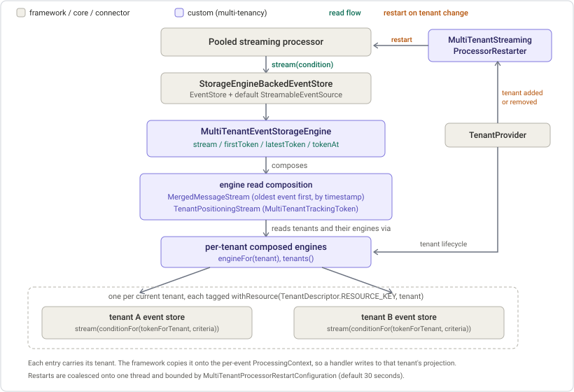

# ADR 002: Multi-tenant pooled streaming (issue [#210](https://github.com/AxonIQ/axoniq-framework/issues/210))

Date: 2026-07-24
Status: accepted
Extends: [ADR 001, per-tenant event storage routing](adr-001-event-storage-tenant-routing.md) ([#209](https://github.com/AxonIQ/axoniq-framework/issues/209))
Addendum: [the token that makes tenant changes survivable](adr-002-addendum-multi-tenant-token.md)

## Context

[ADR 001](adr-001-event-storage-tenant-routing.md) routes writes per tenant and decides that reads are merged natively inside the `MultiTenantEventStorageEngine`. That engine ships the read-side methods (`stream`, `firstToken`, `latestToken`, `tokenAt`) as throwing stubs in [#209](https://github.com/AxonIQ/axoniq-framework/issues/209), so the write side can be reviewed on its own. This ADR delivers the read side: one ordinary pooled streaming event processor consuming the events of every tenant, each tenant's projection kept separate.

The processor's default source is the standard `EventStore`, which is backed by the routing engine. Folding the merge into the engine therefore makes the standard processor wiring multi-tenant with no separate source to register.

## Decision: merge in the engine, position with a module-owned token, restart on tenant change

### Merge in the engine

`stream(condition)` reads the engine's current tenants (the engine follows the `TenantProvider`), and for each tenant maps its `engineFor(tenant).stream(perTenantCondition)` to tag every entry with the tenant (`withResource(TenantDescriptor.RESOURCE_KEY, tenant)`). The engine composes and caches each tenant's engine itself, so the read side merges the same per-tenant engines the write side routes to. It left-folds the per-tenant streams through core's `MergedMessageStream`, which does the concurrent merge, comparator selection (oldest event first, by timestamp), and completion. A wrapping stream advances the position per entry to the tenant it came from.

`latestToken` and `tokenAt` compose each tenant engine's corresponding token into one. `firstToken` instead names no tenant at all: streaming from it fills in each tenant's own first token when opening that tenant's stream, so a tenant whose early events were pruned still opens at its real first event rather than at zero, while a token written before a tenant existed stays comparable to a later one. That comparison is how a streaming processor recognizes an already-handled event, so naming a tenant the stored token predates would make it rehand events (the reasoning is in the [addendum](adr-002-addendum-multi-tenant-token.md)). No tenants yields an empty token and an empty stream that the coordinator idles on.

This drops the separate `MultiTenantStreamableEventSource`, the engine-to-source adapter, and the `DynamicSourcesTrackingToken` wrapper that the earlier design carried. Those existed only to reuse `MultiStreamableEventSource`, whose `open()` rejects any token that is not a `MultiSourceTrackingToken`. Merging natively removes that constraint.

### Position with a module-owned token

The merged stream is positioned with a `MultiTenantTrackingToken`, holding one position per tenant. It reuses `MultiSourceTrackingToken` for the per-tenant positions, their aggregation, and their serialization, and adds only the union tolerance that token deliberately refuses. It must tolerate the set of tenants changing between opens, because the processor's coordinator compares persisted tokens outside the engine, so a tenant present in only one of two compared tokens is treated as at its beginning. That tolerance is confined to this module-owned token, so the shared `MultiSourceTrackingToken` guardrail stays intact. The reasoning, and the shape the token took, is in the [addendum](adr-002-addendum-multi-tenant-token.md).

### Restart on tenant change

A running merged stream is assembled over the tenants present when it opened, so it cannot take on an added tenant or drop a removed one. The `MultiTenantStreamingProcessorRestarter` restarts the running streaming event processors when the tenant set changes, so each re-opens its stream with the current tenants. It follows the `MultiTenantEventStorageEngine` rather than the `TenantProvider`, because the engine announces a change only once that change is visible through its own tenants. A restarter following the provider can re-open the stream while the engine still reports the previous tenants, which leaves the added tenant out of a stream that nothing re-opens again. The engine is handed to the restarter by the enhancer that builds it, from a start handler on the engine's own component definition, since resolving it would yield a decorator of the type it is registered under. Restarts are coalesced onto a single thread, so discovering ten tenants at startup does not cause ten restarts. Both `registerTenant` and `registerAndStartTenant` announce, so either requests a restart. Each restart is bounded by a safety-net timeout, so a processor that never completes its shutdown or start cannot block the restart thread. A processor that fails or times out is restarted independently of the others, so its failure is logged and retried on the next tenant change rather than skipping the processors after it. The timeout defaults to 30 seconds and is overridable rather than a fixed hard-coded bound, so a deployment whose processors are slow to stop and start can raise it. The framework keeps its own lifecycle timeouts configurable for the same reason (`LifecycleRegistry.registerLifecyclePhaseTimeout`, a typed setter). The override here is a small typed configuration component, `MultiTenantStreamingProcessorRestartConfiguration`, carrying a `DEFAULT` and resolved by its own type, following how the framework's other components carry their settings (`PooledStreamingEventProcessorConfiguration`, `DistributedCommandBusConfiguration`).

### From stream entry to handler

The tenant label rides on the stream entry, and the copy onto the per-event `ProcessingContext` is existing framework code on the pooled streaming path: every resource on the entry, not only the tracking token, is copied onto the context before the handlers run. So the only thing this ADR does is put the tenant on the entry. No tenant information is placed in persisted event metadata, in line with [#205](https://github.com/AxonIQ/axoniq-framework/issues/205).

## Consequences

- One federating engine, the standard `EventStore`, and the standard processor wiring. Reads and writes share one path, and a pooled streaming processor is multi-tenant with no extra configuration.
- A tenant added since a token was written streams from its beginning on the next open. A removed tenant is not read, so re-adding it later replays it.
- The shared model keeps its known properties. A tenant change briefly pauses processing for all tenants because the processor restarts. One replay is everyone's replay. Sequencing is not tenant-isolated until [#254](https://github.com/AxonIQ/axoniq-framework/issues/254). Per-tenant processors and token stores, deferred, remain the escape hatch for tenants that cannot accept these.
- A tenant whose store cannot be read is everyone's outage. The read spans all tenants, so one tenant's read failure surfaces on the merged stream and the pooled processor aborts and retries the whole read with backoff. No tenant progresses until that tenant's engine can be read again or the tenant is removed.
- `MultiTenantTrackingToken`'s class name lands in customer token stores, so a later rename needs a legacy type mapping. Keys of removed tenants stay in stored tokens, which is harmless but accumulates.
- Core's `MergedMessageStream` is pairwise, so the left-fold nests it to a depth of one less than the tenant count, and each streamed event is compared through that nesting. This is negligible for the tenant counts these deployments run, but the per-event cost grows with the tenant count. A future k-way merge in core would remove the nesting.

## Tests

- `MultiTenantTrackingToken` serialization round-trip across the converters, plus union-tolerant comparison tests.
- `stream`, `firstToken`, `latestToken`, and `tokenAt` on the engine, each tenant backed by its own in-memory engine: the merge interleaves two tenants by timestamp, tags each event, resumes from a token, and starts a tenant absent from the token at its beginning.
- The restarter: a coalesced restart of the running processors on a tenant change, and no restart before start or for a stopped processor.
- The configuration wiring: the restarter is registered, the enhancer building the routing engine hands that engine to it at startup, and the subscription is cancelled at shutdown. A restarter nothing hands an engine to reports it, so the inert case stays visible.
- An end-to-end two-tenant pooled streaming test proving a projection consumes both tenants against the right tenant without leaking, and picks up a tenant added at runtime. This is the cross-tenant integration test deferred from [#209](https://github.com/AxonIQ/axoniq-framework/issues/209).
