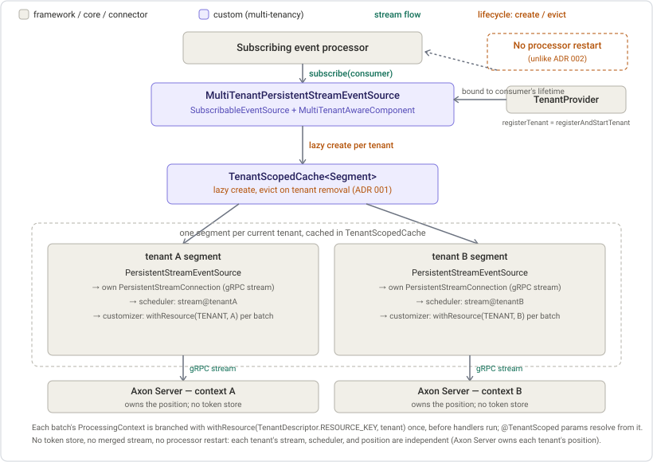

# ADR 004: Multi-tenant persistent streams (issue [#210](https://github.com/AxonIQ/axoniq-framework/issues/210))

Date: 2026-07-29
Status: accepted
Extends: [ADR 001, per-tenant event storage routing](adr-001-event-storage-tenant-routing.md) ([#209](https://github.com/AxonIQ/axoniq-framework/issues/209)), [ADR 002, multi-tenant pooled streaming](adr-002-pooled-streaming.md)

## Context

[ADR 001](adr-001-event-storage-tenant-routing.md) routes event storage per tenant and parks this work explicitly: "Slice 2 (persistent streams) bypasses the `StreamableEventSource` path and needs its own tenant labelling, so it is unaffected." [ADR 002](adr-002-pooled-streaming.md) then delivers the read side for pooled streaming by merging inside the engine. This ADR delivers the third path, the one [#210](https://github.com/AxonIQ/axoniq-framework/issues/210) calls the simplest db-per-tenant solution: a persistent stream per tenant, feeding one subscribing event processor whose handlers resolve per-tenant resources.

Persistent streams differ from both earlier slices in the two ways that decide this design.

- **Axon Server owns the position.** There is no token store, no `TrackingToken` to merge, and no coordinator comparing persisted tokens. Everything the [ADR 002 addendum](adr-002-addendum-multi-tenant-token.md) reasons about is absent here, so no module-owned token is needed.
- **The client builds the `ProcessingContext` itself.** ADR 002 gets tenant labelling for free: it tags the `MessageStream.Entry`, and framework code on the pooled streaming path copies every entry resource onto the per-event context. Persistent streams have no entry. `PersistentStreamConnection.SegmentConnection#processBatch` creates the unit of work and hands its context straight to the batch consumer, so the tenant has to be put there by hand.

A persistent stream is also per Axon Server context by construction: `PersistentStreamConnection` opens its stream on `connectionManager.getConnection(context)`. One connection therefore already means one tenant, which is what makes the labelling a constant rather than a per-event lookup.

## Options considered

Two questions, decided independently: where the fan-out across tenants lives, and how the tenant reaches the `ProcessingContext`.

### Where the fan-out lives

| | Option A: fan out in the event source | Option B: fan out in a multi-tenant connection |
|---|---|---|
| **How** | A `SubscribableEventSource` holding one ordinary `PersistentStreamEventSource` per tenant, fanning a single consumer out to all of them. | A `MultiTenantPersistentStreamConnection` holding one gRPC stream per tenant, behind a single unchanged event source. |
| **Pros** | Reuses the single-tenant source and connection untouched. Per-tenant retry, flow control, segment handling, and acknowledgement stay exactly where they already work. | One component instead of two. |
| **Cons** | Two components on the path instead of one. | Re-implements the segment, retry, and acknowledgement state machine across N contexts, or duplicates the per-segment bookkeeping that `SegmentConnection` already owns per stream. |

Option A wins on reuse. `PersistentStreamConnection` already encapsulates everything hard about one stream, and every one of those concerns is per tenant, not shared: a tenant whose Axon Server context is briefly unreachable must retry its own stream without touching the others. Multiplexing contexts inside one connection would mean re-deriving that isolation.

### How the tenant reaches the context

| | Option A: a customizer seam | Option B: an overridable hook |
|---|---|---|
| **How** | `PersistentStreamConnection` takes a `PersistentStreamContextCustomizer`, applied once per batch. | Extract the batch context preparation into a `protected` method and subclass the connection. |
| **Pros** | Composition. The connection stays single-tenant and gains one generic extension point. `SegmentConnection` stays private. | No new constructor parameter. |
| **Cons** | One more constructor parameter, mitigated by keeping the current arities as no-op overloads. | A `protected` hook reaching into a private inner class's control flow is a worse contract than a function, and inheritance for one line of state contradicts the framework's composition preference. |

## Decision: fan out in the source, tag once per batch through a customizer

### Fan out in the source

A `MultiTenantPersistentStreamEventSource` implements `SubscribableEventSource` and `MultiTenantAwareComponent`. It holds one ordinary `PersistentStreamEventSource` per tenant, built for that tenant's Axon Server context, and fans a single consumer out to all of them.

### Bind the tenant subscription to the consumer's, not to a lifecycle phase

`subscribe` records the consumer and then subscribes the source itself to the `TenantProvider`. The provider replays the tenants it knows, so a stream opens per tenant right there, and tenants added or removed later arrive the same way while the subscription lasts. Cancelling the consumer's registration unsubscribes from the provider again, which closes every tenant's stream and releases its scheduler.

The alternative was a component registered at `TENANT_COMPONENT_SUBSCRIBER_PHASE` that subscribes every source at startup, mirroring `TenantComponentProviderSubscriber`. That does not work here, and the reason is worth recording. Those subscribers find their components through `Configuration#getComponents`, which matches only components registered under the requested type or a subtype; a persistent stream source is registered under the `SubscribableEventSource` interface, so a lookup by the concrete multi-tenant type finds nothing. Looking the sources up by the interface instead would resolve every other `SubscribableEventSource` in the application, and the sources are built lazily when a processor first asks for one, so a fixed phase cannot know they exist yet.

Binding to the consumer removes the ordering question rather than answering it, and it is the stricter invariant: no tenant stream is ever open without a consumer to feed it, and none stays open once the consumer is gone. It also needs no lifecycle registration at all, so a source built by any route follows the tenant lifecycle.

Deadlock is avoided by acquiring the locks in one order. The provider takes its own monitor and calls back into `registerTenant`, which takes the source's, so the source subscribes to and unsubscribes from the provider without holding its own monitor.

### No processor restart

This is where the persistent-stream path is simpler than [ADR 002](adr-002-pooled-streaming.md), which needs a `MultiTenantStreamingProcessorRestarter` because a merged stream is assembled over the tenants present when it opened and cannot take on another. Here each tenant has its own independent stream, so a tenant added at runtime just gets one more, joined to the running consumer immediately, and a removed tenant's stream is closed on its own. Tenant changes therefore never pause processing for the other tenants, and no restart is involved.

`registerTenant` and `registerAndStartTenant` are consequently the same operation. The distinction exists for a component that can hold a tenant without running it, and this source has no such state: it is only registered with the provider while it has a consumer, so a tenant reaching it always has one to feed.

### Tag once per batch

`PersistentStreamConnection` takes a `PersistentStreamContextCustomizer`, a `Function<ProcessingContext, ProcessingContext>` invoked once per batch inside the unit of work before any event is dispatched, whose result is the context that batch is consumed with. The multi-tenant source gives each tenant's connection a customizer branching the context with `withResource(TenantDescriptor.RESOURCE_KEY, tenant)`, so the tenant reaches every event of the batch without being written into the resources of the unit of work spanning it.

Once per batch rather than once per event is right because a connection is bound to one Axon Server context and therefore one tenant: the tenant is invariant across the batch, unlike the tracking token and legacy aggregate data that `enrichContextInformation` refreshes per event.

That single resource is all the tenant labelling this path needs. `TenantComponentParameterResolverFactory` resolves a `@TenantScoped` handler parameter from the tenant on the context, and a subscribing event processor passes the supplied context straight into handler invocation. So a handler resolves its tenant's projection data source with no counterpart to `RegisterTenantDescriptorHandlerInterceptor`, and no tenant information is placed in persisted event metadata, in line with [#205](https://github.com/AxonIQ/axoniq-framework/issues/205).

### A scheduler per tenant

Each tenant's segment gets its own `ScheduledExecutorService`, built through the `PersistentStreamScheduledExecutorBuilder`. Sharing one pool across tenants would make the configured `thread-count` mean "threads for all tenants together" and let one tenant whose stream is retrying occupy threads the others need. Per tenant, `thread-count` keeps meaning "threads for this stream", which is what it means without multi-tenancy, and a tenant's slowness stays its own. The pool is shut down when the tenant's segment is evicted.

### The same stream name in every tenant

Each tenant is a distinct Axon Server context, so one name identifies one server-side stream per context already. The proof of concept suffixed the tenant id onto the name; this does not, so the stream a tenant sees in Axon Server is named exactly as configured.

## Per-tenant lifecycle: lazy create, evict on removal

Segments are held in the `TenantScopedCache` from [ADR 001](adr-001-event-storage-tenant-routing.md), so this slice inherits its registration-token semantics rather than re-deriving them: a segment created concurrently with the removal of its tenant is discarded instead of outliving that registration, and eviction runs exactly once per segment.

Unlike the storage engines that cache holds, a segment owns resources that have to be released, so eviction is wired to a release callback. The cached value is therefore a small segment type owning the three things that belong to one tenant, its event source, its scheduler, and its current subscription, and its release cancels the subscription, which closes the gRPC stream, and shuts the scheduler down.

Eviction is a correctness requirement for the same reason [ADR 001](adr-001-event-storage-tenant-routing.md) gives: `AxonServerTenantProvider.removeTenant()` disconnects the tenant's connection itself, so a create-only cache would keep a segment bound to a dead connection and serve it again after a re-add.

## The internal construction surface

`PersistentStreamEventSourceFactory.build` returns `SubscribableEventSource` rather than the concrete `PersistentStreamEventSource`, so the factory can return the multi-tenant fan-out. That makes the concrete source something callers never name, so it becomes `@Internal` alongside the `PersistentStreamConnection` that already is. What stays public is the factory: it is the documented seam an application replaces, and this module replaces it exactly that way.

Both are breaking changes to types introduced in 5.2.0, taken deliberately while the surface is young, and the reference guide is updated so no example names an internal type.

## Consequences

- A subscribing event processor over a persistent stream is multi-tenant with no extra configuration, and needs no token store: Axon Server tracks each tenant's position in that tenant's own context.
- Tenants are independent. A tenant added or removed at runtime does not pause the others, one tenant's retry does not consume another's threads, and there is no shared replay: resetting one tenant's stream is that tenant's reset alone. This is the ADR 002 shared-processor trade-off inverted, and it is why [#210](https://github.com/AxonIQ/axoniq-framework/issues/210) calls this the simplest db-per-tenant option.
- `thread-count` is per tenant, so a deployment's total thread usage grows with the tenant count. Documented on the multi-tenancy event processing page.
- Ordering is per tenant only, which is what a per-tenant projection needs. No cross-tenant ordering guarantee exists, and none is meaningful when each tenant has its own store.
- `PersistentStreamEventSource` becoming `@Internal` and the widened factory return type are breaking for anyone who named either in 5.2.0.

## Tests

- The customizer on `PersistentStreamConnection`: invoked once per batch, before any event reaches the consumer, and its resource visible on every event's context.
- The multi-tenant source: `subscribe` opens a stream for every tenant known to the provider; a tenant's events carry that tenant and never another's; a tenant added while subscribed joins the running consumer; cancelling one tenant's registration closes only that tenant's stream and scheduler while the others keep running; unsubscribing closes all of them, as does the provider's shutdown; a conflicting consumer is rejected while the same one is idempotent; subscribing with no tenants is a no-op that later tenants join.
- The factory: the per-tenant thread count is taken from the settings the stream was configured under, whether by map key or explicit name, and falls back to the auto-persistent-stream settings.
- The configuration wiring: the multi-tenant factory replaces the default only while multi-tenancy is active, and an application-supplied factory takes precedence over both.
- A two-tenant `MultiTenantPersistentStreamIT` over a real multi-context Axon Server: one subscribing processor consumes both tenants, every event is labelled with the tenant whose stream delivered it, no event is attributed to another tenant, and a tenant created at runtime is consumed too.

Cross-tenant isolation is therefore covered twice, and deliberately so. The integration test proves it end to end, but like every multi-tenancy integration test it only runs where an Axon Server license is present and is skipped without one. The unit-level equivalent, two tenants driven through in-memory persistent streams, runs in an ordinary build and is what keeps the labelling guarded there.

An append is routed by the tenant on its processing context, so the integration test puts it there, the way the tenant-descriptor handler interceptor does on the command path. Resolving the tenant from event metadata is only the fallback for a publish that has no context at all.

Tenant removal is asserted at unit level only. The test container suppresses the context `DELETED` update the `AxonServerTenantProvider` needs, so an integration test for it would not observe the removal.

## Scope

Per-tenant pooled streaming with physical separation, its per-tenant token stores, and the tenant-aware transaction managers stay in [#210](https://github.com/AxonIQ/axoniq-framework/issues/210)'s remaining slices. Tenant-specific sequencing policies are deferred to [#254](https://github.com/AxonIQ/axoniq-framework/issues/254). This slice adds no dependency on any of them.
