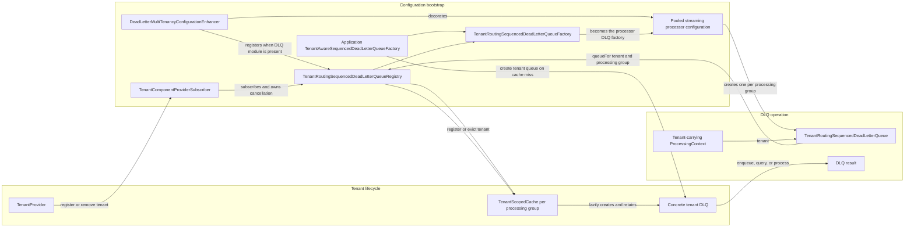
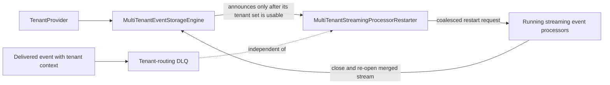

# ADR 006: Tenant-aware dead-letter queue integration (issue [#214](https://github.com/AxonIQ/axoniq-framework/issues/214))

Date: 2026-08-27
Status: accepted

## Context

Dead-letter queues are generic framework infrastructure. Multi-tenancy needs two additional guarantees around them:

- Enqueuing a dead letter must select the queue and its storage resources for the tenant handling the event.
- Processing a dead letter later must establish that tenant before the queue invokes event handling.

The multi-tenancy module must not make dead-letter-queue support mandatory for applications that do not use it. At the
same time, applications using JDBC or JPA queues may need a different `DataSource` and therefore a different queue
factory for every tenant. A generic `DeadLetterQueueConfiguration#factory()` cannot be assumed to make that selection.

## Decision: optional, auto-detected DLQ integration

The multi-tenancy module has an optional dependency on the DLQ module. Its dedicated DLQ configuration enhancer checks
whether the DLQ classes are present and applies tenant-aware DLQ wiring only when they are available. When the DLQ
module is absent, the enhancer does nothing.

This retains a composable module boundary: enabling multi-tenancy alone neither loads nor requires dead-letter-queue
infrastructure, while an application that includes both modules receives the tenant-aware integration automatically.

A dedicated multi-tenancy-DLQ bridge module was considered. It would also keep the two dependencies separate, but the
direct optional dependency plus the missing-class guard already provides that optionality. Introducing another module
only to connect these capabilities would add structure without adding a distinct runtime or configuration boundary, so
it is deliberately not used.

## Decision: configuration-owned DLQ tenant lifecycle

The tenant-aware DLQ integration uses a configuration-owned registry as the owner of tenant lifecycle and cached
queues:

1. The multi-tenancy enhancer registers a DLQ registry as a configuration component.
2. `TenantComponentProviderSubscriber` subscribes that registry to the `TenantProvider` at application startup and
   retains the resulting registration for shutdown.
3. The registry owns the `TenantScopedCache` instances that lazily create tenant-specific DLQs and evict them when a
   tenant is removed.
4. `TenantRoutingSequencedDeadLetterQueue` remains a thin adapter: it resolves the tenant from the processing context
   and asks the registry for that tenant's DLQ. It neither owns a cache nor subscribes itself.
5. `TenantRoutingSequencedDeadLetterQueueFactory` adapts the tenant-aware factory to the event processor's regular
   factory contract and passes it, with the registry, to each routing queue it creates.

The registry keys its lazily created `TenantScopedCache` instances by processing group. It registers every known tenant
with a new cache before using it, and cancels the tenant's registrations in every cache when that tenant is removed.
Re-adding a tenant consequently creates fresh tenant queues.

This reuses the established subscription lifecycle: a configuration-owned component receives tenant registration and
removal events, and its subscription is explicitly cancelled at application shutdown. It prevents dynamically created
queues from subscribing in their constructors and leaving a subscription with no owner.

### Components and their collaboration

The following components have distinct responsibilities:

- `DeadLetterMultiTenancyConfigurationEnhancer` is the optional integration point. When the DLQ module is present, it
  registers the registry and replaces the processor's regular DLQ factory with the routing factory.
- `TenantComponentProviderSubscriber` owns subscriptions of configuration-level `MultiTenantAwareComponent`s. It
  forwards tenant registration and removal to the registry and cancels those subscriptions at shutdown.
- `TenantRoutingSequencedDeadLetterQueueRegistry` owns tenant registrations and one `TenantScopedCache` per processing
  group. A cache owns the concrete queues for its registered tenants and evicts them when a tenant is removed.
- `TenantRoutingSequencedDeadLetterQueueFactory` bridges the processor-facing factory contract, which has no tenant,
  to a routing queue.
- `TenantRoutingSequencedDeadLetterQueue` is deliberately thin. For each DLQ operation it resolves the tenant from the
  `ProcessingContext` and delegates to the registry; it owns neither a cache nor a tenant subscription.
- `TenantAwareSequencedDeadLetterQueueFactory` is the application extension point. It receives the tenant, processing
  group, and configuration, allowing it to select tenant-specific storage such as a `DataSource`.

The cache is keyed by processing group. When it is first created, the registry registers every currently known tenant
with it before resolving the requested queue. A tenant registration is propagated to every existing cache. Removing a
tenant cancels its registrations in every cache and evicts its concrete queues; registering it later consequently
creates fresh queues.

Alternatives considered and rejected for now:

- **Self-subscribing routing queues:** small implementation, but each dynamically created queue owns no retained
  registration and has no explicit cancellation path.
- **A factory that subscribes itself and forwards tenant changes to queues:** avoids per-queue subscriptions, but the
  factory must retain and coordinate registrations for every dynamically created queue. This duplicates the registry's
  lifecycle responsibility without integrating with the established subscriber.
- **Keeping the local `ConcurrentHashMap`:** avoids lifecycle wiring but cannot evict tenant queues when a tenant is
  removed, leaving stale tenant-specific resources reachable.

Queue resolution belongs to the asynchronous DLQ API. An unresolved tenant must complete the returned
`CompletableFuture` exceptionally instead of throwing before a future is returned.

## Related streaming-processor lifecycle: the restarter is necessary, but independent

The DLQ registry does not start, stop, or reconfigure event processors. `MultiTenantStreamingProcessorRestarter` is a
separate, configuration-owned multi-tenancy component; it is not introduced to make tenant-aware DLQs work.

It is required when tenants may be added or removed while streaming processors are running. A
`MultiTenantEventStorageEngine` builds a merged stream over the tenant set at the time `stream(...)` is called. That
open stream cannot acquire a newly added tenant, and it retains a removed tenant's stream. Queue routing cannot repair
that: it runs only after an event has already reached a processor with a tenant-carrying `ProcessingContext`.

The restarter follows the routing event-storage engine rather than the `TenantProvider` directly. This is essential:
the provider can announce a tenant before the engine has finished registering its event-storage resources; restarting
then could reopen a stream over the old set with no later signal to correct it. The engine announces only once its own
tenant set reflects the change.

Tenant changes are coalesced onto one worker. Each cycle restarts only processors that are currently running; it pauses
them briefly, shuts them down, and starts them again. All streaming processors are included because the processor API
does not expose their configured event source, and reopening an unrelated source is safe. The shutdown-and-start
operation has a 30-second default safety-net timeout, configurable through
`MultiTenantStreamingProcessorRestartConfiguration`; this bounds a stall rather than deliberately delaying processing.

For deployments with a fixed tenant set for their entire lifetime, the restarter has no runtime work to do. Removing it
from the default multi-tenancy configuration would, however, make runtime tenant additions and removals incorrect, so
it remains necessary for the supported dynamic-tenant lifecycle.

## Implementation status

The decision is implemented by `TenantRoutingSequencedDeadLetterQueueRegistry`, the tenant-routing queue and factory,
`TenantAwareSequencedDeadLetterQueueFactory`, the DLQ configuration enhancer, and
`TenantComponentProviderSubscriber`.

Focused tests cover:

- enhancer detection of both the present and absent optional DLQ dependency, including registration of the registry;
- subscriber registration of the registry with the `TenantProvider`;
- lazy cache creation after a tenant is registered and cache eviction across multiple processing groups; and
- factory-created queues routing an operation to the queue of the tenant in the processing context; and
- the application-facing factory receiving tenant, processing group, and configuration when a concrete queue is
  created.

## Consequences

- Applications that do not include the DLQ module retain multi-tenancy without any DLQ classes or behaviour.
- Applications that include both modules receive tenant-aware queue routing without duplicating tenant-context setup.
- Tenant queue instances are evicted on removal and recreated on re-registration, rather than remaining reachable in
  a routing queue cache.
- Applications can select physically tenant-specific storage through
  `TenantAwareSequencedDeadLetterQueueFactory`; selecting and configuring that storage remains the application's
  responsibility.
- Framework and application enhancers retain ordering space, so applications can override defaults when necessary.

## Follow-up work

- Add Antora/AsciiDoc documentation for multi-tenancy DLQ configuration and storage.
- Add a datasource-backed integration test demonstrating application selection of tenant-specific DLQ storage.
