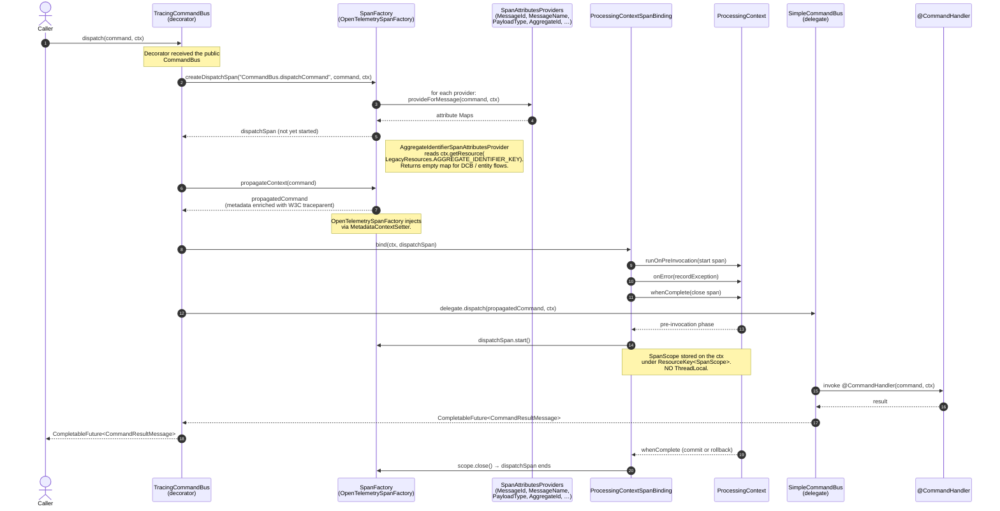
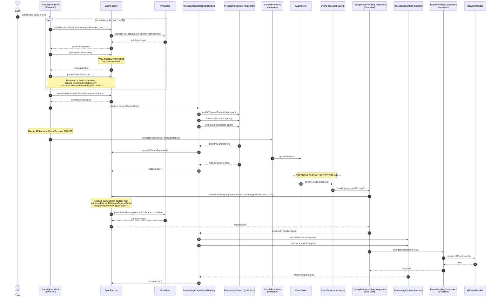
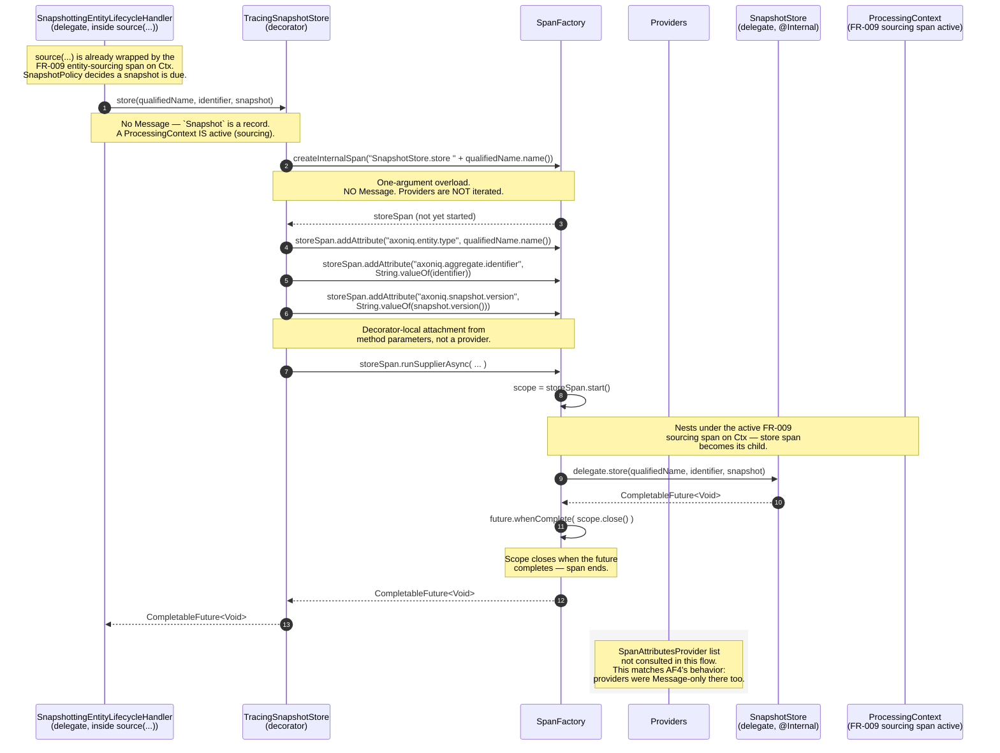

# Worked Flows — How Tracing Actually Runs

**Feature**: 3594 — Distributed Tracing Support

This document walks through three representative flows end-to-end, with mermaid sequence diagrams and inline commentary. The aim is to make the moving parts visible — which class opens the span, where it binds to `ProcessingContext`, when `SpanAttributesProvider`s actually fire, and how cross-thread trace context propagation works without a `ThreadLocal`.

Conventions used in the diagrams:
- `T*` participants are tracing decorators registered by `TracingConfigurationEnhancer` (e.g., `TracingCommandBus`).
- `SF` is the configured `SpanFactory` (the no-op default, or `OpenTelemetrySpanFactory` when the OTel module is on the classpath).
- `Ctx` is the `ProcessingContext` parameter that AF5 buses pass through to handlers.
- `PCB` is the internal `ProcessingContextSpanBinding` helper that opens/closes spans on lifecycle hooks.
- "PROV" denotes the set of `SpanAttributesProvider` beans (built-ins + user-registered).

---

## Flow 1 — Command dispatch + handling (in-process)

The canonical happy path. A caller dispatches a `CommandMessage`; an in-process command bus routes it to a `@CommandHandler`; the surrounding `ProcessingContext` owns the lifecycle of both the dispatch span and (downstream) the handle span.

### Sequence



### Deep commentary

**Step 1 — Caller dispatches**
The caller has a `CommandBus` reference. The Spring autoconfig / programmatic `TracingConfigurationEnhancer` has already replaced the raw bus with `TracingCommandBus` via `DecoratorDefinition.forType(CommandBus.class)`. The caller can't tell the difference — it sees the same `CommandBus` interface.

**Step 2 — `createDispatchSpan(...)` and provider iteration**
This is the **only** point where `SpanAttributesProvider`s are invoked on the command path. The factory walks every registered provider, calls `provideForMessage(command, ctx)`, and merges the returned maps into the span's attribute set. Notice the second parameter: `ctx`. This is what enables `AggregateIdentifierSpanAttributesProvider` to read `LegacyResources.AGGREGATE_IDENTIFIER_KEY` from the surrounding context — see research.md §3.2.

**Step 3 — `propagateContext(command)`**
The W3C trace-context headers (`traceparent`, `tracestate`) are injected into the command's `MetaData`. The `NoOpSpanFactory` returns the command unchanged; the `OpenTelemetrySpanFactory` calls `W3CTraceContextPropagator.inject(...)` with the internal `MetadataContextSetter`. The decorator then passes the propagated command — not the original — to the delegate, so any cross-process hop carries the trace context.

**Step 4 — `ProcessingContextSpanBinding.bind(ctx, dispatchSpan)`**
This is the lifecycle-binding step. Instead of `try/finally` around the dispatch call (the AF4 style, which doesn't survive async continuations), we register three callbacks on the `ProcessingLifecycle`:

| Phase | Hook | Action |
|---|---|---|
| pre-invocation | `runOnPreInvocation` | `span.start()` — open the scope and store it on `ctx` under `ResourceKey<SpanScope>` |
| any error in any phase | `onError` | `span.recordException(error)` — mark errored, don't close yet |
| terminal (commit or rollback) | `whenComplete` | `scope.close()` — close the OpenTelemetry span exactly once |

This is the no-`ThreadLocal` design: the active span is a resource on the `ProcessingContext`, not a thread-local. Constitution §V is satisfied.

**Step 5 — Delegation**
`delegate.dispatch(propagatedCommand, ctx)` calls into the unmodified `SimpleCommandBus`. From this point, tracing is invisible to the rest of the framework.

**Step 6–9 — Handler invocation**
The `@CommandHandler` runs. If an interceptor wraps it, the interceptor is "inside" tracing — the dispatch span includes interception time. If the handler throws, the exception propagates back; `ctx.onError(...)` fires; `whenComplete(...)` closes the span. If the handler succeeds, `whenComplete(...)` fires anyway and closes the span. **Closing is idempotent**.

> **Handler-side span?**  In an in-process dispatch, the handler is invoked synchronously on the same context. The `dispatchSpan` already covers the handler. A separate "handle" span would be added when the dispatch crosses a process boundary (next flow shows it).

### Where `SpanAttributesProvider` fires in this flow

Only at step 2 (`createDispatchSpan(...)`). The handler invocation does not call providers again — there is no second `createHandlerSpan(...)` because handling happens within the same context as dispatch. The dispatchSpan IS the span over the whole command processing.

---

## Flow 2 — Event publish + asynchronous event handler (cross-thread trace propagation)

The case that breaks `ThreadLocal`-based tracing: the publisher and handler run on different threads, possibly with different `ProcessingContext`s. Trace context must travel via metadata.

### Sequence



### Deep commentary

**Steps 1–11 — Publish-side (per-event span + commit-events span)**
This is the two-span pattern from the previous clarification (research.md §3.1). For each event in the list, `TracingEventSink` opens a **short-lived publish-event span** that scopes the `propagateContext(event)` call only. This is what writes the W3C `traceparent` header into the event's metadata. Without that, the handler side has no parent to attach to.

**Steps 12–20 — Commit-events span bound to `ProcessingContext`**
After all the per-event spans have closed, `TracingEventSink` opens a `commitEventsSpan` via `createInternalSpan(...)` and binds it to `ctx`. The span opens at `runOnPrepareCommit` (when the event bus actually flushes events to the store) and closes at `whenComplete` (after the whole UoW finishes). This mirrors AF4's `createCommitEventsSpan()`. Note: `createInternalSpan` does **not** call providers — the commit-events span has no associated `Message`, and the `axoniq.event.*` attributes have already been captured on the per-event spans in steps 2–10.

**Steps 21–22 — Cross-thread boundary**
The event store hands the event to an asynchronous `EventProcessor` (e.g., `PooledStreamingEventProcessor`) on a separate thread, in a separate `ProcessingContext` (`ctx2`). The publisher's `ctx` may be finished by now. **The only thing connecting the two sides is the W3C trace context in the event's metadata.**

**Step 23 — `createHandlerSpan(...)`**
This is where the cross-thread propagation completes. Inside `OpenTelemetrySpanFactory.createHandlerSpan(...)`:

```java
io.opentelemetry.context.Context parent = propagator.extract(
        io.opentelemetry.context.Context.current(),
        event.getMetaData(),
        MetadataContextGetter.INSTANCE);
io.opentelemetry.api.trace.Span span = tracer.spanBuilder(operationName)
        .setParent(parent)
        .setSpanKind(SpanKind.CONSUMER)
        .startSpan();
```

The handler span is rooted under the publisher's trace, not under whatever thread-local context happens to be active on the consumer thread. Constitution §V's no-`ThreadLocal` rule is satisfied because the propagation uses the event metadata, not a process-wide global.

**Steps 24–30 — Provider invocation + lifecycle binding on `ctx2`**
Same shape as Flow 1. Providers fire once for the handler span. The lifecycle binding closes the span when `ctx2` completes.

### Where `SpanAttributesProvider` fires in this flow

- Once per event during publish-side iteration (`createDispatchSpan` per event).
- Once on the handler side (`createHandlerSpan`).
- **Not** on the `commitEventsSpan` (no Message).

---

## Flow 3 — Snapshot store/load (no Message, providers DO NOT fire)

This is the case the user asked about. **AF5 has no `Snapshotter` component** (it lives in `stash/todo`); snapshot creation is an inline `SnapshotPolicy`-gated side-effect of `SnapshottingEntityLifecycleHandler.source(...)`. The decoratable surface is the registered (`@Internal`) `SnapshotStore`. `SnapshotStore.store(...)` receives a `Snapshot` *record*, not a `Message`, so the decorator owns all attribute attachment, and the store/load spans nest under the FR-009 entity-sourcing span via the active `ProcessingContext`. See spec.md clarification 2026-05-26 (option B3) and `af4-span-inventory.md` §1.8.

### Sequence



### Deep commentary

**Steps 1–2 — Entry point, no `Message` involved**
AF5 has no `Snapshotter.scheduleSnapshot`. The snapshot is created inline inside `SnapshottingEntityLifecycleHandler.source(...)` (gated by `SnapshotPolicy`), which calls `SnapshotStore.store(qualifiedName, identifier, snapshot)`. We decorate `SnapshotStore` (the registered, `@Internal` component) — `store(...)` receives a `Snapshot` *record*, not a `Message`. A `ProcessingContext` IS active here because the call happens inside `source(...)`, which the FR-009 sourcing decorator has already wrapped.

**Step 3 — `createInternalSpan(String)`**
The factory builds the span purely from the operation name. **Providers are not iterated.** This is deliberate (see research.md §5 and the snapshot clarifications):
- The decorator already has the typed data it cares about (entity type via `qualifiedName.name()`, identifier, snapshot version).
- Providers in AF4 only fired on Messages — we are not regressing.
- Adding provider iteration here would require providers to handle a null `Message`, complicating every provider for no concrete callers.

**Steps 4–6 — Decorator attaches attributes directly**
`Span.addAttribute(...)` writes attributes from the `store(...)` parameters. These mirror the attributes AF4's `SnapshotterSpanFactory` attached via its bespoke `createSnapshotSpan(aggregateType, aggregateIdentifier)` method — plus `axoniq.snapshot.version` (available in AF5 from the `Snapshot` record). The path is direct.

**Steps 7–10 — `runSupplierAsync` over the async store**
`SnapshotStore.store(...)` is asynchronous (`CompletableFuture<Void>`). The decorator uses the imperative `Span.runSupplierAsync(...)` helper:
- Opens the scope (in OpenTelemetry this momentarily makes the OTel `Context.current()` point at the new span — the only place we touch the OTel `ThreadLocal`, and it's at an imperative edge).
- Runs the supplier (which produces the `CompletableFuture<Void>`).
- Registers `whenComplete` on the future to close the scope.

Because a `ProcessingContext` IS active during sourcing, the store span naturally nests under the FR-009 sourcing span (the OTel parent is whatever is current when the scope opens). If a decorator author preferred, the span could instead be bound to `ctx` lifecycle hooks via `ProcessingContextSpanBinding`; `runSupplierAsync` is chosen here because the store call is a self-contained async operation, not a UoW-phase-spanning one.

**Why no providers**
Concretely: imagine a user-defined `TenantSpanAttributesProvider` that reads tenant id from `MetaData`. `SnapshotStore.store(...)` has a `Snapshot` record (which carries metadata) but no `Message` — and the SPI is `provideForMessage(Message, ctx)`. Even if we passed `provideForMessage(null, ctx)`, every provider would have to handle the null Message. That is the price the AF4 SPI didn't pay (it never called providers for snapshot spans), and we're not paying it either. The store-span attributes the decorator attaches (`axoniq.entity.type`, `axoniq.aggregate.identifier`, `axoniq.snapshot.version`) cover the snapshot case directly.

If, in some future iteration, snapshot spans **do** need provider input, the response is a **pure addition**: add `createInternalSpan(String, ProcessingContext)` and have providers handle the `null Message` case. Not in scope today.

### Repository load / save — same shape

`TracingRepository.load(id, ctx)` and `TracingRepository.save(id, ctx)` follow the same pattern as snapshot creation, with one difference: there usually IS a `ProcessingContext` (because repository operations run inside a command-handling UoW). The decorator can therefore bind the span to the context's lifecycle hooks instead of using `runSupplierAsync`:

```java
@Override
public CompletableFuture<E> load(Object identifier, ProcessingContext ctx) {
    Span span = spanFactory.createInternalSpan("Repository.load " + entityType());
    span.addAttribute("axoniq.aggregate.identifier", String.valueOf(identifier));
    ProcessingContextSpanBinding.bind(ctx, span);
    return delegate.load(identifier, ctx);
}
```

Same answer for providers: `createInternalSpan(String)` does not iterate them; the decorator attaches what it knows directly.

---

## Flow 4 — Streaming event processor batch (`PooledStreamingEventProcessor`)

This is the case the previous "consumer side" of Flow 2 elided. AF4 produced **two nested spans** here — `StreamingEventProcessor.batch` (root per batch) and `EventProcessor.process` (child per event). Flow 2 only showed the per-event side. Flow 4 shows the full nesting in AF5 via Option C (lazy-open on shared `ProcessingContext`).

The full design comparison, AF4 vs Option C coverage matrix, and the rejected alternatives (A — `TracingEventProcessor` decorator; B+upstream — `BatchInterceptor` SPI on PSEP config; D — `UnitOfWorkFactory` decoration; F — drop batch span) are documented in [`research-batch-tracing.md`](./research-batch-tracing.md).

### Sequence

```mermaid
sequenceDiagram
    autonumber
    participant WP   as WorkPackage<br/>(AF5, internal)
    participant UoW  as Batch UnitOfWork<br/>(ProcessingContext)
    participant PEHC as ProcessorEventHandlingComponents
    participant TEH  as TracingEventHandlingComponent<br/>(decorator)
    participant SF   as SpanFactory
    participant PCB  as ProcessingContextSpanBinding
    participant EHC  as EventHandlingComponent<br/>(delegate)
    participant H    as @EventHandler

    WP->>UoW: unitOfWorkFactory.create()
    WP->>UoW: runOnPreInvocation(ctx -> {<br/>  ctx.putResource(Segment.RESOURCE_KEY, segment);<br/>  ctx.putResource(BATCH_END_RESOURCE_KEY, lastToken);<br/>})
    WP->>UoW: onInvocation(ctx -> batchProcessor.process(eventBatch, ctx))
    WP->>UoW: runOnPrepareCommit(ctx -> storeToken(lastToken, ctx))
    WP->>UoW: runOnAfterCommit(ctx -> updateSegmentStatus(...))

    WP->>UoW: execute()
    UoW->>UoW: pre-invocation: attach Segment + token resources
    UoW->>PEHC: handle(entries, ctx)

    loop for each entry in entries
        PEHC->>PEHC: perEventCtx = ctx.withResource(<br/>  TrackingToken.RESOURCE_KEY, entryToken)
        Note over PEHC: ResourceOverridingProcessingContext —<br/>non-overridden keys fall through to ctx,<br/>so getResource(Segment.RESOURCE_KEY)<br/>still works on perEventCtx.

        PEHC->>TEH: handle(event, perEventCtx)

        alt First event in this batch ctx
            TEH->>TEH: perEventCtx.computeResourceIfAbsent(<br/>  BATCH_SPAN_KEY, () -> openBatchSpan(perEventCtx))
            Note right of TEH: computeResourceIfAbsent on a non-overridden<br/>key falls through and stores on the<br/>BATCH ctx — visible to every subsequent event.

            TEH->>TEH: isStreamingBatch =<br/>  perEventCtx.getResource(Segment.RESOURCE_KEY) != null
            Note over TEH: Replaces AF4's<br/>`this instanceof StreamingEventProcessor`<br/>boolean. No boolean parameter survives.

            alt isStreamingBatch && !config.disableBatchTrace
                TEH->>SF: createInternalSpan(<br/>  "StreamingEventProcessor.batch")
                SF-->>TEH: batchSpan
                TEH->>PCB: bindBatch(perEventCtx, batchSpan)
                PCB->>UoW: runOnPreInvocation(batchSpan.start)
                Note over PCB,UoW: pre-invocation already fired —<br/>so the start runs immediately<br/>on the next yield.
                PCB->>UoW: onError(batchSpan.recordException)
                PCB->>UoW: whenComplete(batchSpan.end)
                Note over PCB,UoW: Hooks delegate from perEventCtx<br/>down to the BATCH ctx — span<br/>closes when the batch UoW completes,<br/>AFTER prepareCommit + afterCommit.
            else otherwise
                TEH->>TEH: batchSpan = NoOpSpan.INSTANCE
                Note over TEH: Subscribing processor (no Segment),<br/>or user set disableBatchTrace=true,<br/>or in distributedInSameTrace mode<br/>within the time window.
            end
        else Subsequent events
            TEH->>TEH: batchSpan looked up — already opened
        end

        TEH->>SF: createHandlerSpan("EventProcessor.process",<br/>  event, perEventCtx)
        SF-->>TEH: eventSpan (child of batchSpan)
        TEH->>PCB: bindPerEvent(perEventCtx, eventSpan)
        Note over PCB: Per-event hooks delegate through<br/>perEventCtx → batchCtx; the eventSpan<br/>closes when this single event's chain<br/>of CompletableFutures completes.

        TEH->>EHC: delegate.handle(event, perEventCtx)
        EHC->>H: invoke @EventHandler
        H-->>EHC: result
        EHC-->>TEH: MessageStream.Empty
        TEH-->>PEHC: MessageStream.Empty
    end

    PEHC-->>UoW: MessageStream.Empty
    UoW->>UoW: prepareCommit: storeToken(lastToken, ctx)
    Note over UoW: Token-store write — INSIDE batchSpan.<br/>Matches AF4 createBatchSpan coverage.

    UoW->>UoW: commit
    UoW->>UoW: afterCommit: updateSegmentStatus(...)
    Note over UoW: Status update — INSIDE batchSpan.

    UoW-->>WP: complete
    UoW->>PCB: whenComplete fires
    PCB->>SF: batchSpan.end()
    Note right of PCB: Batch span closes here —<br/>encloses everything from<br/>first handle() through afterCommit.
```

### Deep commentary

**Steps 1–5 — Batch UoW setup (outside the batch span)**
`WorkPackage.processBatch` (`AxonFramework5/.../WorkPackage.java:377-394`) builds the UoW, attaches `Segment.RESOURCE_KEY` and `BATCH_END_RESOURCE_KEY` in `runOnPreInvocation`, registers the per-event handling in `onInvocation`, the token-store write in `runOnPrepareCommit`, and the status update in `runOnAfterCommit`. **No tracing decorator has been invoked yet.** This mirrors AF4 lines 313-323 of `WorkPackage.processEvents()` and is intentionally outside the batch span (AF4 didn't cover this either).

**Steps 6–8 — Per-event sub-context shadows the batch ctx**
`ProcessorEventHandlingComponents.handle` (`AxonFramework5/.../ProcessorEventHandlingComponents.java:110-124`) creates a `ResourceOverridingProcessingContext` per event, overriding only `TrackingToken.RESOURCE_KEY`. Reads of `Segment.RESOURCE_KEY` and writes to `BATCH_SPAN_KEY` transparently fall through to the parent batch ctx (verified at `ResourceOverridingProcessingContext.java:185-228`). This is the load-bearing AF5 contract that makes Option C work.

**Steps 9–16 — Lazy batch-span open on first event**
The first per-event `handle()` calls `perEventCtx.computeResourceIfAbsent(BATCH_SPAN_KEY, …)`. Because `BATCH_SPAN_KEY` is not the overridden key, the call falls through to the batch ctx — the supplier runs once, the span is stored on the **batch ctx**, and every subsequent per-event call in the same batch finds the same span. The batch span is bound to the batch UoW's `whenComplete` via `ProcessingContextSpanBinding`, so it closes after `runOnAfterCommit` — covering token-store write and status update, matching AF4.

**Steps 17–23 — Per-event spans become children of the batch span**
Once the batch span exists in `BATCH_SPAN_KEY` on the batch ctx, every per-event `createHandlerSpan` call sees it as the currently-active span and parents the per-event span underneath. This is the AF5 mapping of AF4's `createBatchSpan(...).runCallable(() -> createProcessEventSpan(...).runCallable(() -> handler))` nesting.

**Steps 24–26 — Token-store write and status update are inside the batch span**
`runOnPrepareCommit` → `storeToken(lastToken, ctx)` and `runOnAfterCommit` → `updateSegmentStatus(...)` both run during `unitOfWork.execute()`, which is still open when the batch span exists. The batch span closes in `whenComplete` (step 27), after `afterCommit` has fired. **AF4 coverage parity is preserved.**

### How AF4's `EventProcessorSpanFactory` toggles map to Option C

| AF4 property | Option C behavior |
|---|---|
| `disableBatchTrace=true` | `openBatchSpan` returns `NoOpSpan.INSTANCE`; per-event spans become roots (or linked-back to publisher when propagation header is present in `event.getMetaData()`) |
| `distributedInSameTrace=true` (within `distributedInSameTraceTimeLimit`) | Skip batch span; per-event `createHandlerSpan` extracts the W3C parent from `event.getMetaData()`, becomes a child of the publisher's trace |
| `distributedInSameTrace=true` (outside the time window) | Behaves like the default — new batch root trace |
| `streaming=false` (AF4's `instanceof StreamingEventProcessor`) | `ctx.getResource(Segment.RESOURCE_KEY)` is null on the batch ctx; `openBatchSpan` returns `NoOpSpan.INSTANCE` — `SubscribingEventProcessor` produces no batch span, matching AF4 |

### Where `SpanAttributesProvider` fires in this flow

- **Per-event span** (step 21): `createHandlerSpan(..., event, perEventCtx)` iterates providers once per event. The `axoniq.aggregate.identifier` attribute appears on these spans when `LegacyResources.AGGREGATE_IDENTIFIER_KEY` is present on the ctx (legacy aggregate-based event streams).
- **Batch span** (step 14): `createInternalSpan("StreamingEventProcessor.batch")` does **not** iterate providers — there is no `Message` parameter. The batch span only carries the operation name. This matches AF4 — `createBatchSpan` was an internal-span path there too.

---

## Cheat sheet — "When does my `SpanAttributesProvider` fire?"

| Span | Factory method | Providers iterated? | How attributes get attached |
|---|---|---|---|
| `CommandBus.dispatchCommand <name>` | `createDispatchSpan` | **Yes** | Providers + propagation |
| `CommandBus.handleCommand <name>` (distributed only) | `createHandlerSpan` | **Yes** | Providers + extract W3C parent |
| `EventBus.publishEvent <name>` (per event) | `createDispatchSpan` | **Yes** | Providers + propagation |
| `EventBus.commitEvents` | `createInternalSpan` | No | None needed |
| `EventProcessor[name].process <event>` | `createHandlerSpan` | **Yes** | Providers + extract W3C parent |
| `QueryBus.query <name>` | `createDispatchSpan` | **Yes** | Providers + propagation |
| `QueryBus.handle <name>` (distributed only) | `createHandlerSpan` | **Yes** | Providers + extract W3C parent |
| `QueryUpdateEmitter.emit <type>` | `createDispatchSpan` | **Yes** | Providers + propagation |
| `Repository.load <entityType> <id>` | `createInternalSpan` | No | `TracingRepository` attaches `axoniq.aggregate.identifier` |
| `Repository.save <entityType> <id>` | `createInternalSpan` | No | Same |
| `SnapshotStore.store <entityType>` | `createInternalSpan` | No | `TracingSnapshotStore` attaches `axoniq.entity.type` + `axoniq.aggregate.identifier` + `axoniq.snapshot.version` (AF5 has no `Snapshotter`; nests under FR-009 sourcing span) |
| `SnapshotStore.load <entityType>` | `createInternalSpan` | No | Same (minus version) |
| `@EventSourcingHandler` and other annotation handlers | (wrapped via `TracingHandlerEnhancerDefinition`) | **Yes** (handler-span path) | Providers + extract W3C parent |

Rule of thumb: **`SpanAttributesProvider` fires when the decorator has a `Message` to hand over and not before.** Internal spans use direct `Span#addAttribute(...)` from the decorator's typed parameters.

---

## Reference

- Public API contract: [contracts/public-api.md](./contracts/public-api.md)
- Design rationale, AF4→AF5 mapping, `ProcessingContextSpanBinding`, propagation, aggregate-id sourcing, non-Message-span design: [research.md](./research.md)
- Streaming-batch span design — AF4 vs Option C coverage, rejected alternatives (`TracingEventProcessor`, upstream `BatchInterceptor`, `UnitOfWorkFactory` decoration, drop-batch-span), implicit `Segment.RESOURCE_KEY` contract: [research-batch-tracing.md](./research-batch-tracing.md)
- Exhaustive AF4 SpanFactory ↔ AF5 decorator mapping — 9 families × 44 methods, every AF4 production caller, cross-check against AF4 reference guide span names, implementation reference for each `Tracing*` decorator: [af4-span-inventory.md](./af4-span-inventory.md)
- Quickstart for users: [quickstart.md](./quickstart.md)
- Spec including all clarifications: [spec.md](./spec.md)
