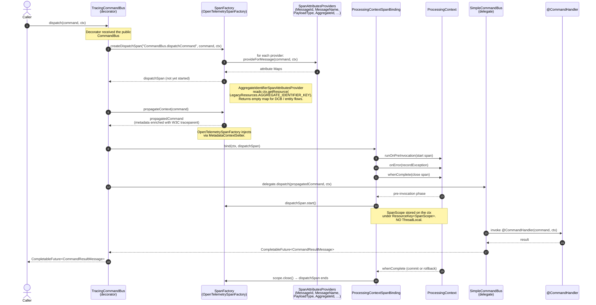
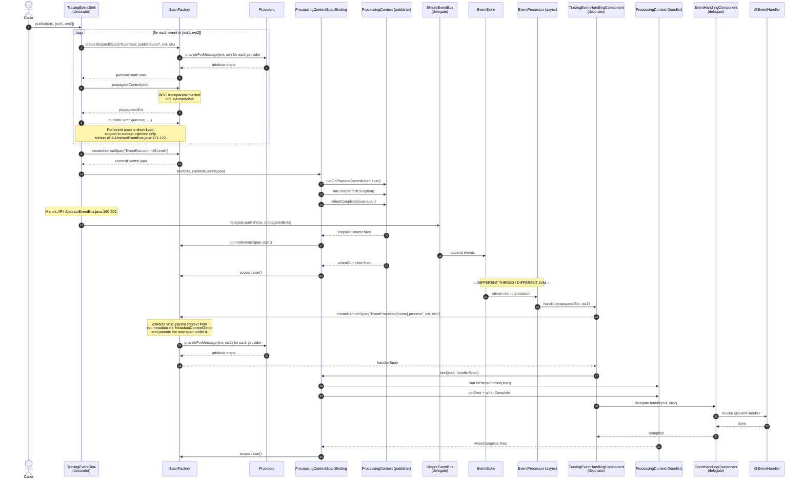
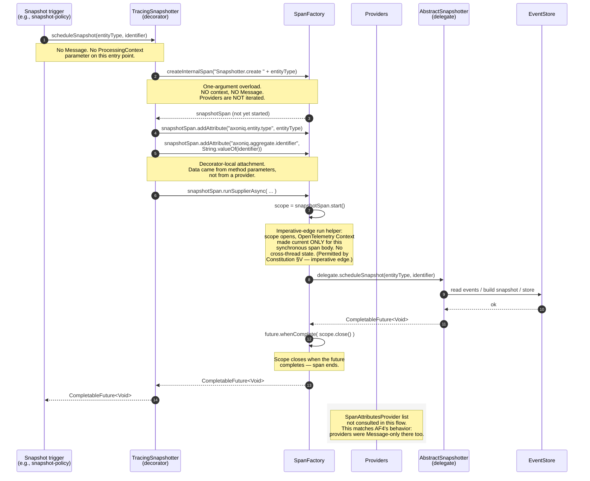

# Worked Flows — How Tracing Actually Runs

**Feature**: 3594 — Distributed Tracing Support

This document walks through three representative flows end-to-end, with mermaid sequence diagrams and inline commentary. The aim is to make the moving parts visible — which class opens the span, where it binds to `ProcessingContext`, when `SpanAttributesProvider`s actually fire, and how cross-thread trace context propagation works without a `ThreadLocal`.

Conventions used in the diagrams:
- `T*` participants are tracing decorators registered by `TracingConfigurationEnhancer` (e.g., `TracingCommandBus`).
- `SF` is the configured `SpanFactory` (the no-op default, or `OpenTelemetrySpanFactory` when the OTel module is on the classpath).
- `Ctx` is the `ProcessingContext` parameter that AF5 buses pass through to handlers.
- `PCB` is the internal `ProcessingContextSpanBinding` helper that opens/closes spans on lifecycle hooks.
- "PROV" denotes the set of `SpanAttributesProvider` beans (built-ins + user-registered).

---

## Flow 1 — Command dispatch + handling (in-process)

The canonical happy path. A caller dispatches a `CommandMessage`; an in-process command bus routes it to a `@CommandHandler`; the surrounding `ProcessingContext` owns the lifecycle of both the dispatch span and (downstream) the handle span.

### Sequence



### Deep commentary

**Step 1 — Caller dispatches**
The caller has a `CommandBus` reference. The Spring autoconfig / programmatic `TracingConfigurationEnhancer` has already replaced the raw bus with `TracingCommandBus` via `DecoratorDefinition.forType(CommandBus.class)`. The caller can't tell the difference — it sees the same `CommandBus` interface.

**Step 2 — `createDispatchSpan(...)` and provider iteration**
This is the **only** point where `SpanAttributesProvider`s are invoked on the command path. The factory walks every registered provider, calls `provideForMessage(command, ctx)`, and merges the returned maps into the span's attribute set. Notice the second parameter: `ctx`. This is what enables `AggregateIdentifierSpanAttributesProvider` to read `LegacyResources.AGGREGATE_IDENTIFIER_KEY` from the surrounding context — see research.md §3.2.

**Step 3 — `propagateContext(command)`**
The W3C trace-context headers (`traceparent`, `tracestate`) are injected into the command's `MetaData`. The `NoOpSpanFactory` returns the command unchanged; the `OpenTelemetrySpanFactory` calls `W3CTraceContextPropagator.inject(...)` with the internal `MetadataContextSetter`. The decorator then passes the propagated command — not the original — to the delegate, so any cross-process hop carries the trace context.

**Step 4 — `ProcessingContextSpanBinding.bind(ctx, dispatchSpan)`**
This is the lifecycle-binding step. Instead of `try/finally` around the dispatch call (the AF4 style, which doesn't survive async continuations), we register three callbacks on the `ProcessingLifecycle`:

| Phase | Hook | Action |
|---|---|---|
| pre-invocation | `runOnPreInvocation` | `span.start()` — open the scope and store it on `ctx` under `ResourceKey<SpanScope>` |
| any error in any phase | `onError` | `span.recordException(error)` — mark errored, don't close yet |
| terminal (commit or rollback) | `whenComplete` | `scope.close()` — close the OpenTelemetry span exactly once |

This is the no-`ThreadLocal` design: the active span is a resource on the `ProcessingContext`, not a thread-local. Constitution §V is satisfied.

**Step 5 — Delegation**
`delegate.dispatch(propagatedCommand, ctx)` calls into the unmodified `SimpleCommandBus`. From this point, tracing is invisible to the rest of the framework.

**Step 6–9 — Handler invocation**
The `@CommandHandler` runs. If an interceptor wraps it, the interceptor is "inside" tracing — the dispatch span includes interception time. If the handler throws, the exception propagates back; `ctx.onError(...)` fires; `whenComplete(...)` closes the span. If the handler succeeds, `whenComplete(...)` fires anyway and closes the span. **Closing is idempotent**.

> **Handler-side span?**  In an in-process dispatch, the handler is invoked synchronously on the same context. The `dispatchSpan` already covers the handler. A separate "handle" span would be added when the dispatch crosses a process boundary (next flow shows it).

### Where `SpanAttributesProvider` fires in this flow

Only at step 2 (`createDispatchSpan(...)`). The handler invocation does not call providers again — there is no second `createHandlerSpan(...)` because handling happens within the same context as dispatch. The dispatchSpan IS the span over the whole command processing.

---

## Flow 2 — Event publish + asynchronous event handler (cross-thread trace propagation)

The case that breaks `ThreadLocal`-based tracing: the publisher and handler run on different threads, possibly with different `ProcessingContext`s. Trace context must travel via metadata.

### Sequence



### Deep commentary

**Steps 1–11 — Publish-side (per-event span + commit-events span)**
This is the two-span pattern from the previous clarification (research.md §3.1). For each event in the list, `TracingEventSink` opens a **short-lived publish-event span** that scopes the `propagateContext(event)` call only. This is what writes the W3C `traceparent` header into the event's metadata. Without that, the handler side has no parent to attach to.

**Steps 12–20 — Commit-events span bound to `ProcessingContext`**
After all the per-event spans have closed, `TracingEventSink` opens a `commitEventsSpan` via `createInternalSpan(...)` and binds it to `ctx`. The span opens at `runOnPrepareCommit` (when the event bus actually flushes events to the store) and closes at `whenComplete` (after the whole UoW finishes). This mirrors AF4's `createCommitEventsSpan()`. Note: `createInternalSpan` does **not** call providers — the commit-events span has no associated `Message`, and the `axoniq.event.*` attributes have already been captured on the per-event spans in steps 2–10.

**Steps 21–22 — Cross-thread boundary**
The event store hands the event to an asynchronous `EventProcessor` (e.g., `PooledStreamingEventProcessor`) on a separate thread, in a separate `ProcessingContext` (`ctx2`). The publisher's `ctx` may be finished by now. **The only thing connecting the two sides is the W3C trace context in the event's metadata.**

**Step 23 — `createHandlerSpan(...)`**
This is where the cross-thread propagation completes. Inside `OpenTelemetrySpanFactory.createHandlerSpan(...)`:

```java
io.opentelemetry.context.Context parent = propagator.extract(
        io.opentelemetry.context.Context.current(),
        event.getMetaData(),
        MetadataContextGetter.INSTANCE);
io.opentelemetry.api.trace.Span span = tracer.spanBuilder(operationName)
        .setParent(parent)
        .setSpanKind(SpanKind.CONSUMER)
        .startSpan();
```

The handler span is rooted under the publisher's trace, not under whatever thread-local context happens to be active on the consumer thread. Constitution §V's no-`ThreadLocal` rule is satisfied because the propagation uses the event metadata, not a process-wide global.

**Steps 24–30 — Provider invocation + lifecycle binding on `ctx2`**
Same shape as Flow 1. Providers fire once for the handler span. The lifecycle binding closes the span when `ctx2` completes.

### Where `SpanAttributesProvider` fires in this flow

- Once per event during publish-side iteration (`createDispatchSpan` per event).
- Once on the handler side (`createHandlerSpan`).
- **Not** on the `commitEventsSpan` (no Message).

---

## Flow 3 — Snapshot creation (no Message, providers DO NOT fire)

This is the case the user asked about. Snapshot creation has no inbound `Message` — it's triggered by a threshold inside the snapshotter. The decorator owns all attribute attachment.

### Sequence



### Deep commentary

**Steps 1–2 — Entry point, no `Message` involved**
The snapshot trigger (event processor reaching threshold, scheduled job, etc.) calls `Snapshotter.scheduleSnapshot(entityType, identifier)`. There is no `Message`, and depending on the trigger there may or may not be a `ProcessingContext` available. The decorator's method signature simply doesn't accept one.

**Step 3 — `createInternalSpan(String)` — one-argument overload**
The factory builds the span purely from the operation name. **Providers are not iterated.** This is deliberate (see research.md §5 and the previous clarification):
- The decorator already has the typed data it cares about (entity type, identifier).
- Providers in AF4 only fired on Messages — we are not regressing.
- Adding a provider iteration here would require providers to handle a null `Message` and / or a null context, complicating every provider for no concrete callers.

**Steps 4–5 — Decorator attaches attributes directly**
`Span.addAttribute(...)` writes attributes onto the span before it starts (or after — order doesn't matter for the OTel SDK). The two attributes attached here are the ones AF4's `SnapshotterSpanFactory` used to attach via its bespoke `createSnapshotSpan(aggregateType, aggregateIdentifier)` method. The shape is preserved; the path is direct.

**Steps 6–11 — Imperative-edge `runSupplierAsync`**
Because there is no `ProcessingContext`, we cannot bind the span to lifecycle hooks. We fall back to the imperative `Span.runSupplierAsync(...)` helper:
- Opens the scope (in OpenTelemetry this momentarily makes the OTel `Context.current()` point at the new span — the only place we touch the OTel `ThreadLocal`, and it's at an imperative edge).
- Runs the supplier (which produces the `CompletableFuture<Void>`).
- Registers `whenComplete` on the future to close the scope.

This matches the AF4 fallback shape (see `AbstractEventBus.java:144`'s no-UoW branch from the earlier research note).

**Why no providers**
Concretely: imagine a user-defined `TenantSpanAttributesProvider` that reads tenant id from `MetaData`. There is no metadata on a snapshot span — there is no Message. The provider has nothing to read. Even if we passed `provideForMessage(null, null)`, every provider would have to handle both nulls. That is the price the AF4 SPI didn't pay (it never called providers for snapshot spans), and we're not paying it either.

If, in some future iteration, snapshot spans **do** need provider input — e.g., the surrounding `ProcessingContext` carries a tenant id — the response is a **pure addition**: add `createInternalSpan(String, ProcessingContext)` and have providers handle the `null Message` case. Not in scope today.

### Repository load / save — same shape

`TracingRepository.load(id, ctx)` and `TracingRepository.save(id, ctx)` follow the same pattern as snapshot creation, with one difference: there usually IS a `ProcessingContext` (because repository operations run inside a command-handling UoW). The decorator can therefore bind the span to the context's lifecycle hooks instead of using `runSupplierAsync`:

```java
@Override
public CompletableFuture<E> load(Object identifier, ProcessingContext ctx) {
    Span span = spanFactory.createInternalSpan("Repository.load " + entityType());
    span.addAttribute("axoniq.aggregate.identifier", String.valueOf(identifier));
    ProcessingContextSpanBinding.bind(ctx, span);
    return delegate.load(identifier, ctx);
}
```

Same answer for providers: `createInternalSpan(String)` does not iterate them; the decorator attaches what it knows directly.

---

## Cheat sheet — "When does my `SpanAttributesProvider` fire?"

| Span | Factory method | Providers iterated? | How attributes get attached |
|---|---|---|---|
| `CommandBus.dispatchCommand <name>` | `createDispatchSpan` | **Yes** | Providers + propagation |
| `CommandBus.handleCommand <name>` (distributed only) | `createHandlerSpan` | **Yes** | Providers + extract W3C parent |
| `EventBus.publishEvent <name>` (per event) | `createDispatchSpan` | **Yes** | Providers + propagation |
| `EventBus.commitEvents` | `createInternalSpan` | No | None needed |
| `EventProcessor[name].process <event>` | `createHandlerSpan` | **Yes** | Providers + extract W3C parent |
| `QueryBus.query <name>` | `createDispatchSpan` | **Yes** | Providers + propagation |
| `QueryBus.handle <name>` (distributed only) | `createHandlerSpan` | **Yes** | Providers + extract W3C parent |
| `QueryUpdateEmitter.emit <type>` | `createDispatchSpan` | **Yes** | Providers + propagation |
| `Repository.load <entityType> <id>` | `createInternalSpan` | No | `TracingRepository` attaches `axoniq.aggregate.identifier` |
| `Repository.save <entityType> <id>` | `createInternalSpan` | No | Same |
| `Snapshotter.create <entityType> <id>` | `createInternalSpan` | No | `TracingSnapshotter` attaches `axoniq.entity.type` + `axoniq.aggregate.identifier` |
| `Snapshotter.read <entityType> <id>` | `createInternalSpan` | No | Same |
| `@EventSourcingHandler` and other annotation handlers | (wrapped via `TracingHandlerEnhancerDefinition`) | **Yes** (handler-span path) | Providers + extract W3C parent |

Rule of thumb: **`SpanAttributesProvider` fires when the decorator has a `Message` to hand over and not before.** Internal spans use direct `Span#addAttribute(...)` from the decorator's typed parameters.

---

## Reference

- Public API contract: [contracts/public-api.md](./contracts/public-api.md)
- Design rationale, AF4→AF5 mapping, `ProcessingContextSpanBinding`, propagation, aggregate-id sourcing, non-Message-span design: [research.md](./research.md)
- Quickstart for users: [quickstart.md](./quickstart.md)
- Spec including all clarifications: [spec.md](./spec.md)
