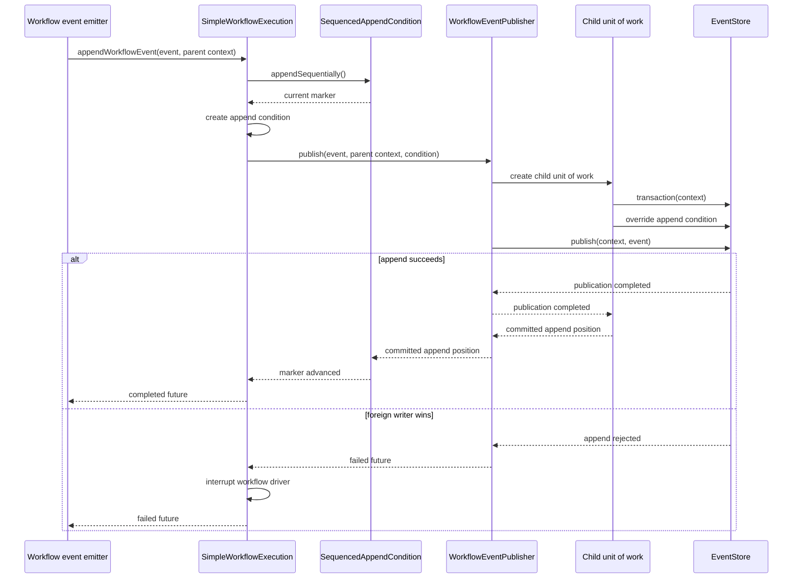

# ADR-015: DCB Append Conditions

- Name: DCB Append Conditions
- Status: Accepted
- Date: 2026-08-12

## Context

Every workflow event was appended unconditionally, so nothing could reject a second writer.

A node that stops refreshing its segment claim loses it without observing it: the release callback only runs on the
happy path, so the node keeps its instances resident and keeps appending while another node has restored them. The
in-memory spawn de-duplication in `WorkflowSpawnRouting` cannot see a peer process.

The event store is the only state both writers share.

A workflow instance behaves like one long-lived command handler, but it cannot keep one processing context open for
its lifetime: every append runs in a short unit of work of its own, and `copyResources` deliberately drops the
event-store transaction between them. So the marker a command handler would keep on its context has to live somewhere
else.

## Decision

Every workflow event appends under an `AppendCondition` with criteria `workflowId=X`, the instance's own sourcing
criteria, anchored at a consistency marker carried per instance. Read filter and write conflict definition are the
same, exactly the DCB source-decide-append loop.

### The append condition

`SimpleWorkflowExecution` owns a package-private `SequencedAppendCondition`: the position that instance last wrote
at, plus the queue that keeps its appends in line. The condition is an implementation detail, not an execution API.
The engine restores it through the narrow `WorkflowExecution.restoreAppendPosition(...)` operation.

| moment | position |
|---|---|
| spawn | none. First append (`WorkflowStarted`) anchors at `ORIGIN`: the instance must not exist at all. Once per instance lifetime, the create-without-load idiom. |
| restore on segment claim | the position that instance's own sourcing read ended at. Each instance is read in a unit of work of its own, so the position is at or after its own last event, and before anything written after that read. |
| after each append | advanced to the transaction's `appendPosition()`, read after the unit of work completed (it is written in a nested after-commit handler). Never advanced on rejection. |

A position shared by every instance of one claim does not work, which is why each instance reads in its own unit of
work. A transaction ends at the lowest of its reads, so a previous owner appending while the claim is still reading
leaves an instance anchored before an event that same claim sourced. Its first append is then rejected by its own
history and the instance runs nowhere.

### Serialization

Appends of one instance are chained: each one starts once the previous one has finished, so it is handed the position
that one wrote at. Parallel steps therefore commit one after another, siblings never conflict with each other, and no
sourcing per append is needed. A rejection therefore always means a foreign writer: a rejection carries no authorship,
so retrying past one could double-record under a genuine second writer.

### Rejection

`SimpleWorkflowExecution.appendWorkflowEvent` is the only append path. It creates the condition and delegates child
unit-of-work publication to `WorkflowEventPublisher`. On rejection it logs a warning and interrupts the execution,
reusing the path `releaseWorkflowsFor` already uses. It never retries, never publishes a compensating event, and never
fails the workflow, since a failure would publish the terminal event the condition exists to prevent.

### Invocation path

All workflow-owned emitters enter through `SimpleWorkflowExecution`. The execution creates the append condition, then
`WorkflowEventPublisher` creates the child unit of work, installs that condition, publishes, and returns the committed
append position.

## Consequences

Duplicate side effects are prevented, not just detected: a step publishes `STARTED` and blocks until it is redelivered
before invoking its action, so a rejected `STARTED` means the action never runs.

A body already inside its call when the claim moved still lands that effect, and nobody re-runs it, so the step ends
indeterminate with an orphan effect.

Re-spawning a used workflow id is rejected by the `ORIGIN`-anchored first append instead of silently lost.

`RETRYING` needs no special case: conditions assert nothing new after the marker, not the absence of a fact, so
legitimate repeats pass.

No new tags. The step-scoped tags a previous iteration added (`stepName`, `stepEvent`, `workflowEvent=terminal`) are
gone; `workflowId` was already on every engine event.

The conflict window per append is marker-to-head, not origin-to-head, so the check does not degrade as the store
grows.

Two interleaved writers can both get rejected and both stop; the instance stays durable and parks until the next
claim restores it. Safety over liveness.

A user-published event tagged `workflowId=X` by a custom tag resolver would falsely conflict with instance `X`'s
appends. Engine events are the only ones tagged this way by the engine's own resolver.

The engine requires an Event Store supporting DCB, like Axon's in-memory, Axon Server or PostgreSQL. A sink that is no `EventStore` carries no
transaction to attach a condition to, so it accepts every append and nothing detects that the check is gone. A start
refuses such a sink instead of running without the check.

Restoring a segment costs one unit of work per instance rather than one per claim, since that is what makes each
instance's read, and the position it ends at, its own.
