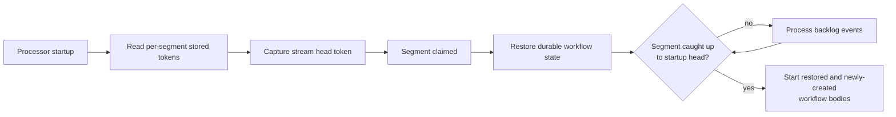

# ADR-017: Remove Workflow Replay

- Name: Remove workflow replay
- Status: Proposed
- Date: 2026-08-31

## Context

The workflow engine currently couples durable workflow restoration to event-processor replay. Restored state is only
current up to a segment's stored token. Events after that token can start, complete, or otherwise change a workflow
before the segment reaches the head of the stream.

Starting a restored workflow body before that catch-up completes is unsafe. It can execute a workflow whose later event
is already present in the backlog and terminal. `WorkflowReplayPreparedStateTest` demonstrates this case.

## Decision

The library deletes `WorkflowEngineReplaySupport` and replaces it with the smaller internal
`WorkflowEngineCatchUpSupport`. The replacement retains only per-segment token catch-up state, with no replay-status
listener, processor-token scanning, or checkpoint responsibility. A segment restores durable workflow state when claimed
and starts workflow bodies only after that segment has processed its startup backlog.

At startup the engine captures the stream head once. Each event delivery supplies the owning segment's token; when that
token covers the captured head, the engine atomically starts that segment's pending workflow bodies. The gate must track
progress per segment. It must not treat an empty in-memory execution repository as proof that a segment is caught up:
the backlog can still contain a start event followed by a terminal event.

### Concurrency and ordering

The startup head is captured before processor delivery starts. A segment claim restores its workflows before that
segment begins event delivery. The claim path and the delivery path can both observe that a segment is caught up, so the
transition to the caught-up state must be an atomic add. Only the caller that performs that transition starts pending
workflow bodies. This prevents duplicate body starts when claim completion races the first delivered event.

Segment release removes its caught-up state. A later claim therefore repeats restoration and token-based catch-up for
the new owner.

Workflow state remains event sourced and workflows remain recoverable after shutdown, failover, and segment
reassignment. Checkpoint coordination remains in place, but it is independent of replay.

This decision does not change state rehydration, replay-drift protection, or the `migrateVersion` API: those protect the
re-execution of a restored workflow body and are not tied to processor catch-up.

## Consequences

- The standalone replay support component and its configuration API are removed.
- Internal catch-up state remains necessary until the processor proves each claimed segment is current through token
  coverage, without replay-status callbacks.
- Applications must not rely on processor replay as a workflow migration mechanism.
- Durable state restoration, segment ownership, cancellation, and checkpoint safety remain supported.
