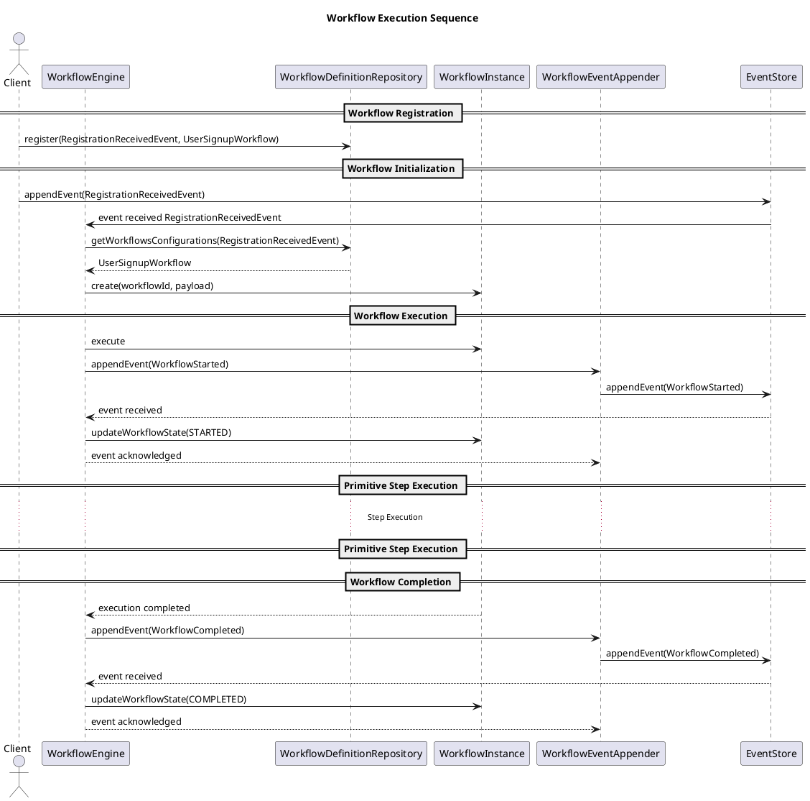

# Workflow Engine

```plantuml
@startuml

title Workflow Execution Sequence

actor Client
participant WorkflowEngine
participant WorkflowDefinitionRepository
participant WorkflowInstance
participant WorkflowEventAppender
participant EventStore

== Workflow Registration ==
Client -> WorkflowDefinitionRepository: register(RegistrationReceivedEvent, UserSignupWorkflow)

== Workflow Initialization ==
Client -> EventStore: appendEvent(RegistrationReceivedEvent)
EventStore -> WorkflowEngine: event received RegistrationReceivedEvent
WorkflowEngine -> WorkflowDefinitionRepository: getWorkflowsConfigurations(RegistrationReceivedEvent)
WorkflowDefinitionRepository --> WorkflowEngine: UserSignupWorkflow
WorkflowEngine -> WorkflowInstance: create(workflowId, payload)

== Workflow Execution ==
WorkflowEngine -> WorkflowInstance: execute
WorkflowEngine -> WorkflowEventAppender: appendEvent(WorkflowStarted)
WorkflowEventAppender -> EventStore: appendEvent(WorkflowStarted)
EventStore --> WorkflowEngine: event received
WorkflowEngine -> WorkflowInstance: updateWorkflowState(STARTED)
WorkflowEngine --> WorkflowEventAppender: event acknowledged

== Primitive Step Execution ==
... Step Execution ...
== Primitive Step Execution ==

== Workflow Completion ==
WorkflowInstance --> WorkflowEngine: execution completed
WorkflowEngine -> WorkflowEventAppender: appendEvent(WorkflowCompleted)
WorkflowEventAppender -> EventStore: appendEvent(WorkflowCompleted)
EventStore --> WorkflowEngine: event received
WorkflowEngine -> WorkflowInstance: updateWorkflowState(COMPLETED)
WorkflowEngine --> WorkflowEventAppender: event acknowledged

@enduml
```

# Step execution

```plantuml
@startuml

title UserSignupWorkflow Execution Sequence

actor Client
participant WorkflowEngine
participant WorkflowDefinitionRepository
participant WorkflowInstance
participant "Execute\nPrimitive" as Execute
participant "WaitFor\nPrimitive" as WaitFor
participant WorkflowEventAppender
participant EventSubscriptionManager
participant EventStore

== Execute createUser Step ==
WorkflowEngine -> WorkflowInstance: execute()
WorkflowInstance -> Execute: execute("createUser")
Execute -> WorkflowEventAppender: appendEvent(createUserStarted)
WorkflowEventAppender -> EventStore: appendEvent(createUserStarted)
EventStore --> WorkflowEngine: event received
WorkflowEngine -> WorkflowInstance: updateStepState(STARTED)
WorkflowEngine --> WorkflowEventAppender: event acknowledged
WorkflowEventAppender --> Execute: event acknowledged

Execute -> Client: UserService.createUser()
note over Execute: Client Code Execution
Client -> Execute: return "true"

Execute -> WorkflowEventAppender: appendEvent(createUserCompleted)
WorkflowEventAppender -> EventStore: appendEvent(createUserCompleted)
EventStore --> WorkflowEngine: event received
WorkflowEngine -> WorkflowInstance: updateStepState(COMPLETED)
WorkflowEngine --> WorkflowEventAppender: event acknowledged
WorkflowEventAppender --> Execute: event acknowledged
Execute --> WorkflowInstance: result

== Execute activateUser Step ==
WorkflowInstance -> Execute: execute("activateUser")
Execute -> WorkflowEventAppender: appendEvent(activateUserStarted)
WorkflowEventAppender -> EventStore: appendEvent(activateUserStarted)
EventStore --> WorkflowEngine: event received
WorkflowEngine -> WorkflowInstance: updateStepState(STARTED)
WorkflowEngine --> WorkflowEventAppender: event acknowledged
WorkflowEventAppender --> Execute: event acknowledged

Execute -> Client: UserService.activateUser()
note over Execute: Client Code Execution
Client -> Execute: return

Execute -> WorkflowEventAppender: appendEvent(activateUserCompleted)
WorkflowEventAppender -> EventStore: appendEvent(activateUserCompleted)
EventStore --> WorkflowEngine: event received
WorkflowEngine -> WorkflowInstance: updateStepState(COMPLETED)
WorkflowEngine --> WorkflowEventAppender: event acknowledged
WorkflowEventAppender --> Execute: event acknowledged
Execute --> WorkflowInstance: result

== Execute sendWelcomeEmail Step ==
WorkflowInstance -> Execute: execute("sendWelcomeEmail")
Execute -> WorkflowEventAppender: appendEvent(sendWelcomeEmailStarted)
WorkflowEventAppender -> EventStore: appendEvent(sendWelcomeEmailStarted)
EventStore --> WorkflowEngine: event received
WorkflowEngine -> WorkflowInstance: updateStepState(STARTED)
WorkflowEngine --> WorkflowEventAppender: event acknowledged
WorkflowEventAppender --> Execute: event acknowledged

Execute -> Client: NotificationService.sendEmail()
note over Execute: Client Code Execution
Client -> Execute: return

Execute -> WorkflowEventAppender: appendEvent(sendWelcomeEmailCompleted)
WorkflowEventAppender -> EventStore: appendEvent(sendWelcomeEmailCompleted)
EventStore --> WorkflowEngine: event received
WorkflowEngine -> WorkflowInstance: updateStepState(COMPLETED)
WorkflowEngine --> WorkflowEventAppender: event acknowledged
WorkflowEventAppender --> Execute: event acknowledged
Execute --> WorkflowInstance: result

== Wait for Duration ==
WorkflowInstance -> WaitFor: wait("waitASecond", Duration.ofSeconds(1))
WaitFor -> WorkflowEventAppender: appendEvent(waitASecondStarted)
WorkflowEventAppender -> EventStore: appendEvent(waitASecondStarted)
EventStore --> WorkflowEngine: event received
WorkflowEngine -> WorkflowInstance: updateStepState(STARTED)
WorkflowEngine --> WorkflowEventAppender: event acknowledged

WorkflowEventAppender --> WaitFor: event acknowledged
note over WaitFor: Wait for 1 second -> TIMEOUT

WaitFor -> WorkflowEventAppender: appendEvent(waitASecondCompleted)
WorkflowEventAppender -> EventStore: appendEvent(waitASecondCompleted)
EventStore --> WorkflowEngine: event received
WorkflowEngine -> WorkflowInstance: updateStepState(TIMED_OUT)
WorkflowEngine --> WorkflowEventAppender: event acknowledged
WorkflowEventAppender --> WaitFor: event acknowledged
WaitFor --> WorkflowInstance: result

== Wait for MagicHappenedEvent ==
WorkflowInstance -> WaitFor: waitForEvent("waitForMagicToHappen", MagicHappenedEvent.class)
WaitFor -> WorkflowEventAppender: appendEvent(waitForMagicToHappenStarted)
WorkflowEventAppender -> EventStore: appendEvent(waitForMagicToHappenStarted)
EventStore --> WorkflowEngine: event received
WorkflowEngine -> WorkflowInstance: updateStepState(STARTED)
WorkflowEngine --> WorkflowEventAppender: event acknowledged
WorkflowEventAppender --> WaitFor: event acknowledged
WaitFor -> EventSubscriptionManager: subscribe(MagicHappenedEvent.class)
EventSubscriptionManager --> WaitFor: subscription created

note over WaitFor: Time passes
Client -> EventStore: appendEvent(MagicHappenedEvent)

EventStore -> WorkflowEngine: event received MagicHappenedEvent
WorkflowEngine -> EventSubscriptionManager: onEvent(MagicHappenedEvent)
EventSubscriptionManager -> WaitFor: complete(MagicHappenedEvent)
WaitFor -> WorkflowEventAppender: appendEvent(waitForMagicToHappenCompleted)
WorkflowEventAppender -> EventStore: appendEvent(waitForMagicToHappenCompleted)
EventStore --> WorkflowEngine: event received
WorkflowEngine -> WorkflowInstance: updateStepState(COMPLETED)
WorkflowEngine --> WorkflowEventAppender: event acknowledged
WorkflowEventAppender --> WaitFor: event acknowledged
WaitFor --> WorkflowInstance: result

@enduml

```